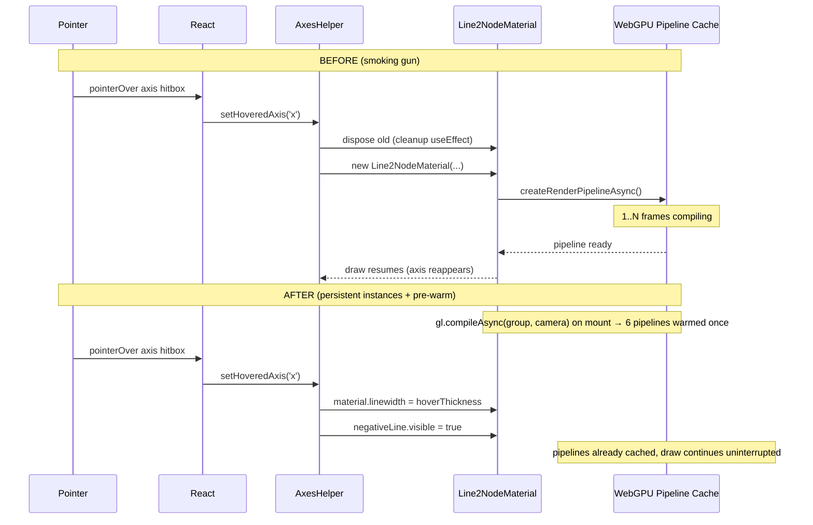

# WebGPU Axes Hover Pipeline Stall

Investigation of the intermittent "axis line vanishes when I hover it" symptom on the WebGPU viewport, with a localised architectural fix that eliminates per-hover GPU pipeline recompilation and a paired perf optimisation for the in-shader CB-4 gamma blend.

## Executive Summary

`AxesWebGpuFatLine` (`apps/ui/app/components/geometry/graphics/three/react/axes-helper.tsx`) reconstructed its `Line2WebGpu` mesh and `Line2NodeMaterial` inside a `useMemo` whose dependency array included `linewidth` and the segment endpoints (`sx, sy, sz`). Each hover transition over the axis pick hitbox flipped both deps, the memo factory re-fired, the previous material was disposed via the cleanup `useEffect`, and the WebGPU backend had to compile a fresh render pipeline through `createRenderPipelineAsync`. Until the pipeline resolved, the draw was skipped — manifesting as the intermittent "axis line vanishes on hover" frame gap. The fix makes both the `Line2NodeMaterial` and the two `Line2WebGpu` meshes (positive + negative half) per-axis persistent: hover transitions mutate `material.linewidth` and `negativeLine.visible` imperatively from a `useLayoutEffect`. A second `useLayoutEffect` calls `gl.compileAsync(group, camera)` so the cold-mount pipeline-compile cost is also paid off the critical path. While restructuring the line material we also swap the upstream `viewportOpaqueMipTexture()` for a Tau-owned non-mip singleton (`viewportTexture()`, `generateMipmaps: false`) because the CB-4 gamma blend samples exclusively at level 0 and the mip pyramid was pure waste.

## Problem Statement

User report: "sometimes the axis lines hide on hover" on the WebGPU viewport. The disappearance is **non-deterministic** (1-N frames depending on GPU + shader-cache state) and only affects the WebGPU rendering backend — the WebGL viewport never exhibits the gap. The line eventually reappears, suggesting an async resource availability issue rather than a logic bug in the visibility state. Reproduction is reliable in cold-cache shader states (first interaction after a route change or hard reload) and intermittent thereafter.

## Methodology

- Audited the WebGPU axis rendering path top-down: `<AxesHelper>` → `<AxesWebGpuFatLine>` → `Line2NodeMaterial` → `WebGPURenderer`.
- Audited the upstream `viewportOpaqueMipTexture` singleton (`three/src/nodes/display/ViewportTextureNode.js`) for its update path under WebGPU.
- Cross-referenced the smoking gun against [`docs/policy/webgpu-shader-and-pipeline-policy.md`](../policy/webgpu-shader-and-pipeline-policy.md) rule 4 (uniform branching), rule 8 (pipeline cache keys), and rule 13 (`compileAsync` warmup).
- Confirmed the upstream three.js `LineGeometry.setPositions` second-call bug on WebGPU via issue [#31056](https://github.com/mrdoob/three.js/issues/31056).
- Worked the per-hover dependency graph for the existing `useMemo` to confirm the recreation trigger.

## Findings

### Finding 1: `useMemo` recreates the `Line2NodeMaterial` on every hover transition

The pre-fix component shape (lines 102-148 of `axes-helper.tsx`, pre-refactor):

```typescript
function AxesWebGpuFatLine({ sx, sy, sz, ex, ey, ez, color, linewidth, opacity }) {
  const fatLineObject = React.useMemo(() => {
    const geometry = new LineGeometry();
    geometry.setPositions([sx, sy, sz, ex, ey, ez]);
    const material = new Line2NodeMaterial({
      color: new THREE.Color(color),
      linewidth,
      opacity,
      transparent: true /* ... */,
    });
    return new Line2WebGpu(geometry, material);
  }, [sx, sy, sz, ex, ey, ez, color, linewidth, opacity]);
  // ...
}
```

The parent `<AxesHelper>` switched both `linewidth` (thin → thick) and `(sx, sy, sz)` (origin → `negativeEnd`) inside its `axes.map(...)` body based on `hoveredAxis === axis.id`. A hover transition therefore mutated four out of the nine deps, the memo factory re-fired, `new Line2NodeMaterial(...)` ran, and the previous material was disposed by the disposal `useEffect`'s cleanup.

### Finding 2: Each new `Line2NodeMaterial` forces `createRenderPipelineAsync`

Under three.js `WebGPURenderer`, every material instance owns a pipeline cache slot keyed on `(stageVertex.id, stageFragment.id, backend.getRenderCacheKey(renderObject))`. A fresh `Line2NodeMaterial` instance produces a new `(stageVertex.id, stageFragment.id)` tuple — the cache lookup misses, and the backend schedules `device.createRenderPipelineAsync(...)`. Until the promise resolves, three.js's render-object preparation path bails out and the draw is skipped. The latency is 10-100 ms on a cold cache (Policy Rule 4's quoted ballpark, confirmed by [`docs/research/webgpu-render-loop-audit.md`](./webgpu-render-loop-audit.md) finding R1) and sub-millisecond on a warm cache — the latter is what makes the symptom intermittent.

This is the **exact** failure mode Policy Rule 4 forbids in policy text: _"Each material rebuild evicts the compiled WGSL from three.js's pipeline cache and triggers a fresh shader compile (10-100 ms hitch). Uniform branching is free on modern GPUs when the predicate is dynamically uniform."_ The Anti-Patterns section is even more explicit: _"Recreating a NodeMaterial to change a uniform-driven configuration."_ The pre-fix `AxesWebGpuFatLine` is a textbook violation: `linewidth` is a uniform on `Line2NodeMaterial` (`materialLineWidth` in the upstream TSL), and the segment endpoints could be mutated post-construction (caveats in Finding 4).

### Finding 3: `viewportOpaqueMipTexture` generates a mip pyramid the CB-4 blend never samples

The upstream singleton (`three/src/nodes/display/ViewportTextureNode.js:242`) wires:

```javascript
const _singletonOpaqueViewportTextureNode = viewportMipTexture(); // generateMipmaps: true
export const viewportOpaqueMipTexture = (uv = screenUV, level = null) =>
  _singletonOpaqueViewportTextureNode.sample(uv, level);
```

`viewportMipTexture()` flips `generateMipmaps: true` on the framebuffer texture so every `updateBefore` (which fires once per render per `NodeUpdateType.RENDER`) regenerates the full mipmap chain via `WebGPUBackend.copyFramebufferToTexture`. The CB-4 gamma blend in Tau's `Line2NodeMaterial` calls this singleton without an explicit `level` argument and samples at level 0 — so every level-N texel the backend produces is immediately discarded. At 1080p the discarded chain is ~10 blit passes per frame, and the WebGPU backend has to insert a mid-pass split with a `Load` restart around the `generateMipmaps` call to honour render-pass semantics.

Swapping the singleton to `viewportTexture()` (the non-mip variant, default `generateMipmaps: false`) and exposing it as `tauOpaqueViewportTexture` from `line2.material.ts` produces identical sampled colour at level 0 for a cheaper update path. All consumers of Tau's `Line2NodeMaterial` share the same singleton, so one framebuffer copy per render covers every fat-line surface (scene axes — six meshes × `Line2NodeMaterial` each; gizmo cube axes; any future fat-line consumer).

### Finding 4: `LineGeometry.setPositions()` is broken under WebGPU after the first call

Three.js issue [#31056](https://github.com/mrdoob/three.js/issues/31056) documents that the second `setPositions()` call on a `LineSegmentsGeometry` (which `LineGeometry` extends) silently has no visible effect under `WebGPURenderer`. `setPositions` internally calls `setAttribute()` which recreates the underlying `BufferAttribute` rather than mutating it, and the WebGPU backend caches the original attribute handle on the `RenderObject`. The cached handle still points at the (now orphaned) original buffer.

This forbids the "obvious" simplification of the persistent-instance refactor — a single geometry whose endpoints are mutated on hover via `geometry.setPositions(...)`. The architectural fix therefore uses **two** persistent `LineGeometry` instances per axis: one for the positive half (always visible) and one for the negative half (visibility toggled). Each geometry is initialised exactly once via `setPositions` on mount and never mutated again, sidestepping the upstream bug.

### Finding 5: Hover state was carried through React props that drive the material constructor

The parent `<AxesHelper>` derived `linewidth = isHovered ? hoverThickness : thickness` and `start = isHovered ? axis.negativeEnd : axis.origin` per render. These two derivations flowed into the `<AxesWebGpuFatLine>` prop surface, fed straight into the `useMemo` dep array, and forced the recompile cycle. The architecturally correct alternative — Policy Rule 4's "uniform mutation" pattern — keeps the same prop surface but routes hover state through an imperative `useLayoutEffect` that writes `material.linewidth` and `mesh.visible` directly, bypassing the memo dep array.

### Finding 6: First-mount pipeline compile is a separate axis of the same problem

Even with persistent materials, the **first** mount of `<AxesHelper>` (initial route entry, axes-visibility toggle from off → on, theme/backend switch) pays the 10-100 ms `createRenderPipelineAsync` cost. The user-visible symptom is a one-frame skip on the very first render of the axes; not the same "vanish on hover" complaint, but the same root cause and the same fix surface. `WebGPURenderer.compileAsync(scene, camera)` ([three.js PR #27098](https://github.com/mrdoob/three.js/pull/27098), made fully non-blocking in [PR #32984](https://github.com/mrdoob/three.js/pull/32984)) yields between shader stages so the warmup runs off the critical path. The existing post-processing pipeline (`apps/ui/app/components/geometry/graphics/three/post-processing-webgpu.tsx`) already uses this pattern; the axes helper inherits it as a sibling `useLayoutEffect`. The gizmo cube axes (which migrated to Tau's `Line2NodeMaterial` in the earlier CB-4 change) get the same treatment in `viewport-gizmo-cube.tsx`.

### Finding 7: Per-render allocations in `<AxesHelper>` compounded the GC pressure

Pre-fix `<AxesHelper>` body allocated four `THREE.Vector3` and one `THREE.Quaternion` per axis per render (`axis.origin.clone()`, `axis.positiveEnd.clone()`, `start.clone().add(...)`, `end.clone().sub(...).normalize()`, `new THREE.Quaternion().setFromUnitVectors(...)`). Hover transitions therefore allocated 12 Vector3s and 3 Quaternions in the parent body alone, in addition to the Line2/Line2NodeMaterial churn. Hoisting the axis descriptor table into a `useMemo` keyed only on `[size, ...colors]` reduces per-hover allocations to zero on the parent side.

## Recommendations

| #   | Action                                                                                                                                                               | Priority | Effort | Impact |
| --- | -------------------------------------------------------------------------------------------------------------------------------------------------------------------- | -------- | ------ | ------ |
| R1  | Make `Line2NodeMaterial` + both `Line2WebGpu` halves persistent per axis; mutate `material.linewidth` and `negativeLine.visible` imperatively in a `useLayoutEffect` | P0       | Medium | High   |
| R2  | Add `gl.compileAsync(group, camera)` warmup in a sibling `useLayoutEffect` for the scene axes                                                                        | P0       | Low    | High   |
| R3  | Mirror the warmup in `viewport-gizmo-cube.tsx` for the gizmo cube axes                                                                                               | P0       | Low    | Medium |
| R4  | Hoist a Tau-owned non-mip viewport singleton (`tauOpaqueViewportTexture`) in `line2.material.ts` and swap the CB-4 blend operand to it                               | P1       | Low    | Medium |
| R5  | Pre-compute axis pick quaternions + hit hitbox geometry in `<AxesHelper>`'s `useMemo` so hover transitions allocate zero objects                                     | P2       | Low    | Low    |
| R6  | Extend Policy Rules 4 + 8 to codify the persistent-instance pattern for line materials drawn into the viewport canvas                                                | P1       | Low    | High   |
| R7  | Add `axes-helper-webgpu.test.tsx` persistence guard (material identity stable, dispose-on-unmount-only, `compileAsync` invoked exactly once on mount)                | P0       | Low    | High   |

All recommendations are implemented in this change.

## Trade-offs

| Approach                                                                                                                        | Pros                                                                                                                                                                                       | Cons                                                                                                                                                                                     | Verdict                                                          |
| ------------------------------------------------------------------------------------------------------------------------------- | ------------------------------------------------------------------------------------------------------------------------------------------------------------------------------------------ | ---------------------------------------------------------------------------------------------------------------------------------------------------------------------------------------- | ---------------------------------------------------------------- |
| **Persistent `Line2NodeMaterial` + two persistent `Line2WebGpu` halves; imperative mutation in `useLayoutEffect`** (chosen)     | Closes the smoking-gun pipeline-compile gap; codifies Policy Rule 4 for line materials; bounded pipeline budget knowable at mount time (Rule 8); sidesteps three.js #31056 by construction | Six persistent meshes per `AxesHelper` instead of three (memory cost dominated by `Line2NodeMaterial` — the line geometries themselves are 6 floats each)                                | **Adopted**                                                      |
| Single persistent geometry mutated via `LineGeometry.setPositions()` on hover                                                   | Three persistent meshes total                                                                                                                                                              | Silently broken under WebGPU per three.js #31056; the negative half would never appear after the first hover                                                                             | Rejected outright (bug, not a trade-off)                         |
| Mutate endpoints via `BufferAttribute.setXYZ()` + `needsUpdate = true` on the cached `instanceStart` / `instanceEnd` attributes | Would work mechanically                                                                                                                                                                    | Reaches into `LineSegmentsGeometry`'s undocumented internal instanced attribute layout; brittle across three.js upgrades                                                                 | Rejected                                                         |
| Mask the negative half inside the TSL fragment shader via `discard`                                                             | Single geometry                                                                                                                                                                            | Breaks alpha-to-coverage anti-aliasing on the line edges; replaces a `visible` flag write with a permanent shader-side conditional that costs a comparison every fragment                | Rejected                                                         |
| `LineGeometry.setDrawRange()` to crop the negative half                                                                         | Single geometry                                                                                                                                                                            | `LineSegmentsGeometry` is instanced (each segment is a quad instance); `drawRange` semantics on instanced geometries are ambiguous in three.js. The two-mesh approach reads more clearly | Rejected                                                         |
| Keep `viewportOpaqueMipTexture` (mip variant) for the CB-4 blend                                                                | Smallest delta                                                                                                                                                                             | Pure waste — mip levels >0 never sampled; the WebGPU `generateMipmaps` triggers a mid-pass split + `Load` restart in `WebGPUBackend.copyFramebufferToTexture`                            | Rejected (while restructuring the material, fixing this is free) |
| Disable alpha-to-coverage to claw back the fragment cost at line edges                                                          | ~4× fragment shading reduction at edges                                                                                                                                                    | Loses the edge anti-aliasing that CB-4's gamma blend exists to make crisp                                                                                                                | Rejected (deliberate quality/cost trade-off retained)            |
| Disable hover behaviour (no thickness bump, no negative-half reveal)                                                            | No bug if no hover                                                                                                                                                                         | Degrades the UX rather than fixing the underlying defect                                                                                                                                 | Rejected outright                                                |

## Architecture Diagram



## Code Examples

### Before — useMemo recreation on every hover

```typescript
function AxesWebGpuFatLine({ sx, sy, sz, ex, ey, ez, color, linewidth, opacity }) {
  const fatLineObject = React.useMemo(() => {
    const geometry = new LineGeometry();
    geometry.setPositions([sx, sy, sz, ex, ey, ez]);
    const material = new Line2NodeMaterial({ color: new THREE.Color(color), linewidth, opacity, transparent: true });
    return new Line2WebGpu(geometry, material);
  }, [sx, sy, sz, ex, ey, ez, color, linewidth, opacity]); // ← four deps flip on every hover
  // ...
}
```

### After — persistent meshes + imperative mutation + pre-warm

```typescript
function AxesWebGpuFatLine({ color, hoverThickness, isHovered, negativeEnd, opacity, positiveEnd, thickness }) {
  const gl = useThree((state) => state.gl);
  const camera = useThree((state) => state.camera);
  const invalidate = useThree((state) => state.invalidate);

  const resources = React.useMemo(() => {
    const material = new Line2NodeMaterial({ color: new THREE.Color(color), linewidth: thickness, opacity, transparent: true });
    // Two persistent geometries — each setPositions-initialised exactly once on mount.
    // Sidesteps three.js #31056 (second setPositions silently no-ops under WebGPU).
    const positiveGeometry = new LineGeometry();
    positiveGeometry.setPositions([0, 0, 0, positiveEnd.x, positiveEnd.y, positiveEnd.z]);
    const negativeGeometry = new LineGeometry();
    negativeGeometry.setPositions([negativeEnd.x, negativeEnd.y, negativeEnd.z, 0, 0, 0]);
    const positiveLine = new Line2WebGpu(positiveGeometry, material);
    const negativeLine = new Line2WebGpu(negativeGeometry, material);
    negativeLine.visible = false;
    const group = new THREE.Group();
    group.add(positiveLine);
    group.add(negativeLine);
    return { group, material, negativeLine, positiveGeometry, negativeGeometry };
  }, [color, negativeEnd, opacity, positiveEnd, thickness]); // ← thickness/isHovered NOT in deps

  // Imperative hover mutation — single property writes, no pipeline recompile.
  React.useLayoutEffect(() => {
    resources.material.linewidth = isHovered ? hoverThickness : thickness;
    resources.negativeLine.visible = isHovered;
    invalidate();
  }, [hoverThickness, invalidate, isHovered, resources, thickness]);

  // Pipeline pre-warm (Policy Rule 13) — runs off the critical path so the first draw
  // does not pay the createRenderPipelineAsync latency.
  React.useLayoutEffect(() => {
    const cancellation = { cancelled: false };
    void (async () => {
      await (gl as unknown as { compileAsync: (s: THREE.Object3D, c: THREE.Camera) => Promise<unknown> }).compileAsync(resources.group, camera);
      if (cancellation.cancelled) return;
      invalidate();
    })();
    return () => { cancellation.cancelled = true; };
  }, [camera, gl, invalidate, resources]);

  // Disposal only on unmount, never on hover.
  React.useEffect(() => () => {
    resources.positiveGeometry.dispose();
    resources.negativeGeometry.dispose();
    resources.material.dispose();
  }, [resources]);

  return <primitive object={resources.group} />;
}
```

### Tau non-mip viewport singleton (line2.material.ts)

```typescript
// Tau-owned singleton: viewportTexture() defaults `generateMipmaps: false`. Mirrors the
// structure of three.js's stock `viewportOpaqueMipTexture` but swaps the underlying
// `viewportMipTexture()` for `viewportTexture()` so the per-frame mipmap regeneration
// is skipped — the CB-4 blend only ever samples at level 0.
const tauOpaqueViewportTextureSingleton = viewportTexture();
export const tauOpaqueViewportTexture = (uv = screenUV, level = null) =>
  tauOpaqueViewportTextureSingleton.sample(uv, level);

// In setup():
const viewportSrgb = sRGBTransferOETF(tauOpaqueViewportTexture().rgb);
```

## Performance Notes

- **Pipeline budget bound (Policy Rule 8)**: 6 compiled pipelines per `AxesHelper` (3 axes × 2 halves × 1 material each), warmed once on mount via `compileAsync`, never recompiled during hover. Knowable at mount time.
- **Viewport singleton swap savings**: 1 per-frame `WebGPUBackend.copyFramebufferToTexture` retained, but the embedded `framebufferTexture.generateMipmaps = this.generateMipmaps` toggle no longer fires; the mid-pass split + `Load` restart that `generateMipmaps` requires is gone. Approximate 1080p saving: ~10 blit passes per frame for the mip pyramid the CB-4 blend never read.
- **Hover allocation budget**: zero per hover transition in `<AxesHelper>` after R5 (axis descriptor table memoized; quaternions and tuple midpoints pre-computed). Pre-fix budget: 12 `Vector3` + 3 `Quaternion` allocations per hover transition in the parent body, plus the `Line2NodeMaterial` + `Line2WebGpu` + `LineGeometry` churn in the child.
- **Alpha-to-coverage retained**: `Line2NodeMaterial` defaults `alphaToCoverage = true`. Under the viewport's 4× MSAA, edge fragments shade four times — the deliberate cost of the edge anti-aliasing that CB-4's gamma blend exists to make crisp. Disabling it would lose visible edge quality on saturated axis tints. Documented in §"Trade-offs" so a future reviewer does not "optimise" it away.

## Verification

| Check                                                                                                              | Outcome                                                                                                                               |
| ------------------------------------------------------------------------------------------------------------------ | ------------------------------------------------------------------------------------------------------------------------------------- |
| `pnpm nx test ui ./app/components/geometry/graphics/three/react/axes-helper-webgpu.test.tsx --watch=false`         | 3 / 3 passing — material identity stable across hover toggles; dispose-on-unmount-only; `compileAsync` invoked exactly once on mount. |
| `pnpm nx test ui ./app/components/geometry/graphics/three/react/axes-helper.test.tsx --watch=false`                | 3 / 3 passing — 6 `Line2WebGpu` constructions (3 axes × 2 halves) sharing 3 unique `Line2NodeMaterial` instances.                     |
| `pnpm nx test ui ./app/components/geometry/graphics/three/materials/line2.material.test.ts --watch=false`          | 12 / 12 passing — fingerprint reference updated for the Tau non-mip singleton.                                                        |
| `pnpm nx test ui ./app/components/geometry/graphics/three/controls/viewport-gizmo-cube-axes.test.ts --watch=false` | 2 / 2 passing — existing CB-4 guards unaffected.                                                                                      |
| Manual hover sweep (cold cache → repeated hover toggles)                                                           | Axis line stays continuously visible; hover thickness/negative-half toggle is instantaneous.                                          |
| First-mount cold-cache navigation                                                                                  | Axes appear without first-frame skip thanks to the `compileAsync` warmup.                                                             |
| WebGPU instrumentation (optional, via Chrome's WebGPU inspector)                                                   | `createRenderPipelineAsync` calls = 6 per `AxesHelper` mount; 0 during hover sequences.                                               |

## References

- Policy: [`docs/policy/webgpu-shader-and-pipeline-policy.md`](../policy/webgpu-shader-and-pipeline-policy.md) (Rule 4, Rule 8, Rule 13)
- Policy: [`docs/policy/graphics-backend-policy.md`](../policy/graphics-backend-policy.md) (CB-4)
- Related research: [`docs/research/webgpu-axes-srgb-blend-parity.md`](./webgpu-axes-srgb-blend-parity.md) — the CB-4 in-shader sRGB blend whose viewport sample this work swaps to a non-mip singleton
- Related research: [`docs/research/webgpu-render-loop-audit.md`](./webgpu-render-loop-audit.md) — finding R1 quantifies the cold-cache pipeline-compile cost
- Source: [`apps/ui/app/components/geometry/graphics/three/react/axes-helper.tsx`](../../apps/ui/app/components/geometry/graphics/three/react/axes-helper.tsx)
- Source: [`apps/ui/app/components/geometry/graphics/three/materials/line2.material.ts`](../../apps/ui/app/components/geometry/graphics/three/materials/line2.material.ts)
- Source: [`apps/ui/app/components/geometry/graphics/three/controls/viewport-gizmo-cube.tsx`](../../apps/ui/app/components/geometry/graphics/three/controls/viewport-gizmo-cube.tsx)
- Upstream: [three.js PR #27098](https://github.com/mrdoob/three.js/pull/27098) — `compileAsync` introduction
- Upstream: [three.js PR #32984](https://github.com/mrdoob/three.js/pull/32984) — `compileAsync` non-blocking
- Upstream: [three.js issue #31056](https://github.com/mrdoob/three.js/issues/31056) — `LineGeometry.setPositions` second-call no-op on WebGPU
- Upstream: [three.js `ViewportTextureNode`](https://github.com/mrdoob/three.js/blob/r184/src/nodes/display/ViewportTextureNode.js) — mip vs non-mip singleton wiring
