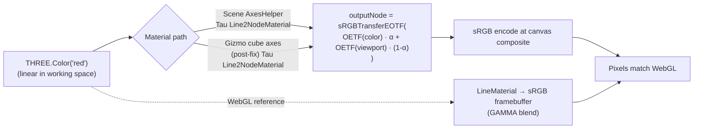

# WebGPU Axes Lines Over-Saturation: Linear-vs-Gamma Blend Parity

Investigation of why the scene `<AxesHelper>` and the viewport gizmo cube axes render visibly more saturated on WebGPU than on WebGL, with a localised architectural fix that closes the seam without re-platforming the overlay scene.

## Executive Summary

Both axis-line surfaces blend the line color over the scene background in **linear** color space on WebGPU and in **gamma (sRGB)** space on WebGL. For saturated overlay tints (`red`, `green`, `rgb(37, 78, 136)`) at `opacity = 0.6` against a dark CAD background the per-channel divergence is >40 sRGB units — well beyond the ~10-15 unit budget the `CB-3` policy entry claims for this seam.

The fix is targeted: Tau's `Line2NodeMaterial` (`apps/ui/app/components/geometry/graphics/three/materials/line2.material.ts`) already performs an explicit manual composition against `viewportOpaqueMipTexture()` in shader; switching that mix from linear-RGB to sRGB via `sRGBTransferOETF` / `sRGBTransferEOTF` (both re-exported from `three/tsl`) reaches perceptual parity with WebGL's gamma-space framebuffer blend. The viewport gizmo cube axes file is migrated to the same Tau subclass so both surfaces pick up the fix uniformly, and the WebGL gizmo `LineMaterial` gains the `transparent: true` flag it was previously missing (a `CB-1` violation that had masked the divergence).

## Problem Statement

User report: WebGPU axes lines (in the scene and in the [viewport gizmo cube](../../apps/ui/app/components/geometry/graphics/three/controls/viewport-gizmo-cube.tsx) via [`createViewportGizmoCubeAxes`](../../apps/ui/app/components/geometry/graphics/three/controls/viewport-gizmo-cube-axes.ts)) render "much stronger in color" than WebGL axes, which look "correctly tuned." Required outcome: bring WebGPU to parity with WebGL.

Two distinct code paths, same visual symptom:

1. **Scene axes** ([axes-helper.tsx](../../apps/ui/app/components/geometry/graphics/three/react/axes-helper.tsx)) — WebGPU branch (`AxesWebGpuFatLine`) used Tau's `Line2NodeMaterial` whose `setup()` already does a manual `color · α + viewportOpaqueMipTexture · (1 - α)` mix in shader.
2. **Gizmo cube axes** — WebGPU branch used the **stock** `three/webgpu` `Line2NodeMaterial`, falling back on the standard GPU transparent blend over the WebGPU `frameBufferTarget`.

Both paths converged on the same linear-space blend, just via different mechanisms.

## Methodology

- Read the two material call sites and the Tau `Line2NodeMaterial` subclass.
- Cross-referenced the policy at [`docs/policy/graphics-backend-policy.md`](../policy/graphics-backend-policy.md) §"Color & Blending Parity" — specifically the S1-S8 seam table and the CB-3 deferred-limitation entry.
- Verified TSL helper availability: `sRGBTransferOETF` / `sRGBTransferEOTF` are re-exported from `three/tsl` (re-exported at `three/src/nodes/TSL.js:99,113` via `display/ColorSpaceFunctions.js`).
- Worked the per-channel arithmetic for the symptomatic case to confirm the divergence magnitude.

## Findings

### Finding 1: Linear-space blend math diverges from WebGL by >40 sRGB units per channel

Reference scenario: X-axis material `THREE.Color('red')` (sRGB `#ff0000`, linear `(1.0, 0.0, 0.0)`) at `α = 0.6` over dark CAD background `#171717` (linear `(0.0078, 0.0078, 0.0078)`).

| Backend               | Blend space                            | Math                                              | Result (sRGB)               |
| --------------------- | -------------------------------------- | ------------------------------------------------- | --------------------------- |
| WebGL                 | Gamma (sRGB-encoded framebuffer)       | per channel: `255 · 0.6 + 23 · 0.4`               | `(162, 9, 9)` — muted red   |
| WebGPU (linear blend) | Linear (`rgba16f` `frameBufferTarget`) | `1.0 · 0.6 + 0.0078 · 0.4 = 0.603`; encode → sRGB | `(205, 23, 23)` — vivid red |
| **Δ per channel**     |                                        |                                                   | **+43, +14, +14**           |

The R-channel divergence (43 sRGB units) is the dominant visual effect; the eye reads it as "much stronger" axis color on WebGPU. Light-mode background math produces a smaller delta but still well outside the `CB-3` policy's claimed ~10-15 unit residual.

### Finding 2: Tau's `Line2NodeMaterial` was performing the manual blend in the wrong color space

The `setup()` method (lines 418-425 pre-fix) builds an explicit `outputNode` for transparent materials:

```typescript
self.outputNode = vec4(
  self.colorNode.rgb.mul(opacityNode).add(viewportOpaqueMipTexture().rgb.mul(opacityNode.oneMinus())),
  self.colorNode.a,
);
```

Both operands are in working linear-sRGB space (`Color.convertSRGBToLinear()` applied on uniform upload — see policy S2). The `mul / add` happens on linear-RGB texels, producing the linear-blend curve that diverges visually from WebGL's gamma blend. The architecture for the manual composition was already in place — the bug was the color space of the math, not the structure.

### Finding 3: The viewport gizmo cube axes WebGPU branch was using stock `three/webgpu` `Line2NodeMaterial`

`apps/ui/app/components/geometry/graphics/three/controls/viewport-gizmo-cube-axes.ts:4` (pre-fix) imported `Line2NodeMaterial` from `three/webgpu`. The stock class delegates to standard GPU blending on the linear-float `frameBufferTarget`, reproducing the same linear-space blend as Finding 1's math.

Routing the gizmo through Tau's `Line2NodeMaterial` does double duty:

1. The CB-4 in-shader sRGB blend (Finding 4) applies, fixing the gizmo's over-saturation.
2. The gizmo inherits the Tau subclass's existing renderer-aware depth encoding (`setupDepth` dispatch on `reversedDepthBuffer` / `logarithmicDepthBuffer`), hardware-clipping override, and reversed-Z trim fix — none of which it strictly required, but all of which are strictly more correct for any line rendered into the viewport canvas.

### Finding 4: A CB-1 violation in the gizmo's WebGL `LineMaterial` partly masked the divergence

`viewport-gizmo-cube-axes.ts` (pre-fix) constructed the WebGL `LineMaterial` with `opacity: 0.6` but without `transparent: true`. `LineMaterial` extends `ShaderMaterial`, which defaults `transparent` to `false`; `THREE.WebGLRenderer` then skipped `gl.BLEND` and the `opacity` uniform was silently dropped at the framebuffer write. The WebGL gizmo lines therefore rendered **fully opaque** at 100% saturation, while the WebGPU side blended at 60% — which inadvertently brought the WebGL gizmo's brightness closer to the WebGPU output, partially masking the seam in the gizmo region (though still visibly worse than parity, especially against dark backgrounds).

Closing the CB-1 violation (`transparent: true` on the WebGL `LineMaterial`) restores the intended `opacity = 0.6` blend on WebGL; the CB-4 sRGB shader blend on WebGPU then brings WebGPU's perception in line with that intended look.

## Recommendations

| #   | Action                                                                                                                                                    | Priority | Effort  | Impact |
| --- | --------------------------------------------------------------------------------------------------------------------------------------------------------- | -------- | ------- | ------ |
| R1  | Wrap the transparent-branch `outputNode` operands in `sRGBTransferOETF` / `sRGBTransferEOTF` so the alpha mix happens in sRGB space (`line2.material.ts`) | P0       | Low     | High   |
| R2  | Switch `viewport-gizmo-cube-axes.ts` WebGPU import from `three/webgpu` to Tau's `Line2NodeMaterial`                                                       | P0       | Low     | High   |
| R3  | Add `transparent: true` to the WebGL `LineMaterial` constructor in `viewport-gizmo-cube-axes.ts` (CB-1 compliance)                                        | P0       | Trivial | Medium |
| R4  | Add fingerprint-based outputNode regression guard in `line2.material.test.ts`                                                                             | P0       | Low     | Medium |
| R5  | New file `viewport-gizmo-cube-axes.test.ts` asserting the WebGPU branch uses the Tau subclass and the WebGL branch sets `transparent: true`               | P0       | Low     | Medium |
| R6  | Promote the seam from "deferred (CB-3)" to a new `CB-4` policy entry that scopes the in-shader sRGB blend to transparent `Line2NodeMaterial` consumers    | P1       | Low     | Medium |

All recommendations are implemented in this change.

## Trade-offs

| Approach                                                                                          | Pros                                                                                                              | Cons                                                                                                                                | Verdict                                                                                |
| ------------------------------------------------------------------------------------------------- | ----------------------------------------------------------------------------------------------------------------- | ----------------------------------------------------------------------------------------------------------------------------------- | -------------------------------------------------------------------------------------- |
| **In-shader sRGB blend on Tau `Line2NodeMaterial`** (chosen)                                      | Localised; reuses the existing manual `viewportOpaqueMipTexture` composition; one material, two consumer surfaces | Only fixes line materials; grid stays on the deferred CB-3 path                                                                     | **Adopted**                                                                            |
| Route the overlay scene through a shared `rgba8unorm-srgb` render target                          | Architecturally complete; would fix grid + axes + any future overlay uniformly                                    | Significant refactor of `SceneOverlay`, post-processing wiring, gizmo render path; large blast radius                               | Rejected — disproportionate for the line case; remains the canonical CB-3 deferred fix |
| Per-backend color constants (e.g. dim WebGPU axis tints)                                          | Trivial change                                                                                                    | Explicitly forbidden by CB-2 ("no historical-bug calibration"); freezes a backend bug into the design contract                      | Rejected                                                                               |
| Disable the manual `viewportOpaqueMipTexture` composition entirely; rely on standard GPU blend    | Smaller TSL graph                                                                                                 | The underlying math is still linear-space on WebGPU — the divergence persists; loses depth-correct blending against the opaque pass | Rejected                                                                               |
| Wrap the colors in `convertSRGBToLinear` on the WebGL side instead (back-port WebGPU's behaviour) | Single math path                                                                                                  | WebGL's canvas drawing buffer is already sRGB-encoded — wrapping again would double-encode and dim the lines                        | Rejected (would break WebGL)                                                           |

## Code Examples

### Before — linear-space mix

```typescript
self.outputNode = vec4(
  self.colorNode.rgb.mul(opacityNode).add(viewportOpaqueMipTexture().rgb.mul(opacityNode.oneMinus())),
  self.colorNode.a,
);
```

### After — sRGB-space mix (with Tau non-mip viewport singleton)

```typescript
const colorSrgb = sRGBTransferOETF(self.colorNode.rgb);
const viewportSrgb = sRGBTransferOETF(tauOpaqueViewportTexture().rgb);
const blendedSrgb = colorSrgb.mul(opacityNode).add(viewportSrgb.mul(opacityNode.oneMinus()));

self.outputNode = vec4(sRGBTransferEOTF(blendedSrgb), self.colorNode.a);
```

The viewport sample swapped from upstream `viewportOpaqueMipTexture()` (`viewportMipTexture()` singleton, `generateMipmaps: true`) to a Tau-owned non-mip singleton (`tauOpaqueViewportTexture()`, an alias around `viewportTexture()` with `generateMipmaps: false`, exported from `line2.material.ts`). The blend samples exclusively at level 0, so the mip pyramid that the upstream singleton regenerates every frame is pure waste. See [`docs/research/webgpu-axes-hover-pipeline-stall.md`](./webgpu-axes-hover-pipeline-stall.md) for the perf measurement and the wider hover-disappearance fix that lands the singleton swap.

### Gizmo cube axes WebGPU branch — import change

```typescript
// Before
import { Line2NodeMaterial } from 'three/webgpu';
// After
import { Line2NodeMaterial } from '#components/geometry/graphics/three/materials/line2.material.js';
```

### Gizmo cube axes WebGL branch — CB-1 compliance

```typescript
const material = new LineMaterial({
  color: line.lineColor,
  linewidth: lineWidth,
  opacity: lineOpacity,
  resolution: new THREE.Vector2(rendererSize, rendererSize),
  transparent: true, // <-- added: closes CB-1 violation, restores intended 0.6 opacity blend
});
```

## Diagrams



## Verification

| Check                                                                                                              | Outcome                                                                                                                                                                                               |
| ------------------------------------------------------------------------------------------------------------------ | ----------------------------------------------------------------------------------------------------------------------------------------------------------------------------------------------------- |
| `pnpm nx test ui ./app/components/geometry/graphics/three/materials/line2.material.test.ts --watch=false`          | 12 / 12 passing — new `outputNode` describe block asserts fingerprint match against sRGB-wrapped reference and mismatch against linear-only reference.                                                |
| `pnpm nx test ui ./app/components/geometry/graphics/three/controls/viewport-gizmo-cube-axes.test.ts --watch=false` | 2 / 2 passing — WebGPU branch instantiates Tau subclass; WebGL branch passes `transparent: true`.                                                                                                     |
| `pnpm nx test ui ./app/components/geometry/graphics/three/react/axes-helper.test.tsx --watch=false`                | 3 / 3 passing — existing scene-axes guards unaffected.                                                                                                                                                |
| Shader snapshot `line2-node-material.json`                                                                         | Byte-identical — `Material.toJSON()` does not traverse the lazily-built TSL graph, so the manual outputNode change is invisible to that surface. The fingerprint check in the new test fills the gap. |
| Shader snapshot `gltf-fat-line-webgpu-node-material.json`                                                          | Byte-identical — `createWebGpuGltfFatLineMaterial` does not set `transparent: true`, so the new sRGB branch is unreachable from that path.                                                            |

## References

- Policy: [`docs/policy/graphics-backend-policy.md`](../policy/graphics-backend-policy.md) §"Color & Blending Parity" CB-3 / CB-4
- Source: [`apps/ui/app/components/geometry/graphics/three/materials/line2.material.ts`](../../apps/ui/app/components/geometry/graphics/three/materials/line2.material.ts)
- Source: [`apps/ui/app/components/geometry/graphics/three/controls/viewport-gizmo-cube-axes.ts`](../../apps/ui/app/components/geometry/graphics/three/controls/viewport-gizmo-cube-axes.ts)
- Source: [`apps/ui/app/components/geometry/graphics/three/react/axes-helper.tsx`](../../apps/ui/app/components/geometry/graphics/three/react/axes-helper.tsx)
- Three.js TSL color-space helpers: `three/src/nodes/display/ColorSpaceFunctions.js`
- Related research: [`docs/research/webgpu-fat-line-renderer-aware-depth.md`](./webgpu-fat-line-renderer-aware-depth.md)
- Related research: [`docs/research/webgpu-edge-line-crispness-gap.md`](./webgpu-edge-line-crispness-gap.md)
