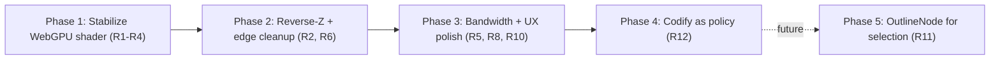

# WebGPU CAD Rendering Pipeline Blueprint

This document captures the target WebGPU rendering architecture for the Tau CAD viewer. It is intended as the source of truth that future planning cycles consult when adding features, tracking three.js upstream, or making trade-offs in the post-processing chain.

## Executive Summary

Our current WebGPU pipeline was assembled incrementally on top of the WebGL `EffectComposer` + `N8AO` setup. After upgrading to three.js r184 (which renamed `PostProcessing` to `RenderPipeline`) and switching to depth-derived normals to side-step a transient bug, we now hit a structural ceiling: GTAO's depth-derived normal path emits WGSL (`textureLoad`/`textureSize` on the scene-pass depth) that is not legal on a multisampled depth attachment, so MSAA and AO are mutually exclusive in the current shape.

Three.js's own `webgpu_postprocessing_ao` example (r184) demonstrates the canonical recipe: a normals + velocity **pre-pass** via MRT, a separate **scene pass** that consumes AO through `builtinAOContext`, **TRAA** as the antialiasing strategy in place of MSAA, and an optional second-stage **FXAA** for static frames. This is the architecture upstream is committing to for WebGPU; it is also the most CAD-friendly path because it preserves AO quality, gives us temporally stable edges on still images (the dominant CAD viewer state), and aligns with `reverseDepthBuffer` for our large-coordinate-range models.

We recommend rebuilding `post-processing-webgpu.tsx` around that recipe, switching from `logarithmicDepthBuffer` to `reverseDepthBuffer` on the WebGPU path, and treating the WebGL `EffectComposer + N8AO` setup as a frozen fallback maintained only for browsers without WebGPU. All viewer-settings capabilities (Surfaces, Lines, Matcap, Post-processing, Environment, Gizmo, Grid, Axes, Up-Direction, Rendering API, Timeout) map cleanly onto this pipeline.

## Table of Contents

- [Problem Statement](#problem-statement)
- [Methodology](#methodology)
- [Findings](#findings)
- [Target Architecture](#target-architecture)
- [Recommendations](#recommendations)
- [Trade-offs](#trade-offs)
- [Reference Implementation Sketch](#reference-implementation-sketch)
- [Migration Roadmap](#migration-roadmap)
- [References](#references)
- [Appendix: TSL Display Node Catalog](#appendix-tsl-display-node-catalog)

## Problem Statement

The viewer surface (`apps/ui/app/components/geometry/cad/viewer-settings.tsx`) advertises a stable feature set: Surfaces, Lines, Matcap, Post-processing (AO), Environment, Gizmo, Grid, Axes, Up-Direction, Rendering API selector, Render Timeout. The WebGL implementation in `post-processing.tsx` delivers those features through `EffectComposer multisampling={4}` + `N8AO`. The WebGPU implementation in `post-processing-webgpu.tsx` was written to mirror the user-visible features but accumulated several incompatible workarounds:

1. `pass(scene, camera)` inherits `renderer.samples` (4 with antialias enabled) → depth attachment becomes `texture_depth_multisampled_2d`.
2. GTAO with `normalNode = null` falls into `getNormalFromDepth`, which calls `textureLoad(depth, p)` and `textureSize(...)` — both invalid on multisampled depth in WGSL.
3. Forcing `samples: 0` makes the shader compile but loses the MSAA edge-AA the WebGL path provided.
4. Switching to MRT-supplied normals does not solve the underlying issue because GTAO's `sampleDepth` still calls `.sample()` on multisampled depth.

These are symptoms of an architectural mismatch: we are running an `EffectComposer`-shaped chain on top of a node graph that expects a different topology. The fix is structural, not local.

## Methodology

We grounded this blueprint in three sources:

| Source                                                         | What we extracted                                                                                                                                                                                                                                                                                                                                       |
| -------------------------------------------------------------- | ------------------------------------------------------------------------------------------------------------------------------------------------------------------------------------------------------------------------------------------------------------------------------------------------------------------------------------------------------- |
| `repos/three.js` r184 (cloned via `pnpm repos clone three.js`) | Canonical `webgpu_postprocessing_ao.html`, `webgpu_postprocessing_traa.html`, `webgpu_postprocessing_fxaa.html`, `webgpu_postprocessing_outline.html`, `webgpu_postprocessing_smaa.html`, `webgpu_reversed_depth_buffer.html`. Source for `PassNode`, `GTAONode`, `TRAANode`, `ContextNode.builtinAOContext`, `PostProcessingUtils.getNormalFromDepth`. |
| Tau workspace                                                  | `apps/ui/app/components/geometry/cad/viewer-settings.tsx`, `cad-viewer.tsx`, `three-context.tsx`, `post-processing.tsx`, `post-processing-webgpu.tsx`, `materials/gltf-edges.ts`, `react/axes-helper.tsx`, `controls/transform-controls.ts`, the `graphics.machine` selectors.                                                                          |
| Public web research                                            | Three.js docs (`TSL.html`, `WebGPURenderer.html`, `webgpu-postprocessing.html`), upstream PRs #28784 (MSAA + post), #29575 (OutlineNode), #29797/#29870 (GTAO + log depth fixes), #29445 (reverse-Z via `EXT_clip_control`), #30082 (`texture_depth_multisampled_2d` for `wgslFn`), #32789 (PostProcessing → RenderPipeline rename).                    |

We additionally cross-checked the bundled three.js (`node_modules/three@0.184.0`) against the cloned r184 source to confirm parity.

## Findings

### F1: The current WebGPU post chain is a port of the WebGL chain, not a port of upstream's WebGPU recipe

The current `post-processing-webgpu.tsx` builds:

```
pass(scene, camera) → MRT(output) → ao(depth, null, camera) → vec4(color.rgb * ao.r, color.a)
```

That topology mirrors `EffectComposer + N8AO`: one full render → one AO pass → one composite. It works on WebGL because `EffectComposer` resolves multisampled targets between passes; it does not work on WebGPU because TSL exposes the multisampled depth attachment directly to GTAO. The shader-level error (`textureDimensions(texture_depth_multisampled_2d, 0)`) is the visible end of that mismatch.

### F2: Three.js r184's canonical WebGPU AO recipe is two passes plus TRAA

`repos/three.js/examples/webgpu_postprocessing_ao.html` is the upstream reference (verified at HEAD `477da61`, version `0.184.0`). It uses this graph:

```javascript
// Pre-pass: opaque-only, MRT-encoded normals + velocity. Depth comes free.
const prePass = pass(scene, camera);
prePass.transparent = false;
prePass.setMRT(
  mrt({
    output: directionToColor(normalView),
    velocity: velocity,
  }),
);
const prePassNormal = sample((uv) => colorToDirection(prePass.getTextureNode().sample(uv)));
const prePassDepth = prePass.getTextureNode('depth');
const prePassVelocity = prePass.getTextureNode('velocity');

// Bandwidth: pack normals into an 8-bit-per-channel texture.
prePass.getTexture('output').type = THREE.UnsignedByteType;

// Main scene pass: full-quality color, lit with AO injected via context.
const scenePass = pass(scene, camera);
const aoPass = ao(prePassDepth, prePassNormal, camera);
aoPass.resolutionScale = 0.5; // half-res AO
aoPass.useTemporalFiltering = true; // denoise via TRAA history
scenePass.contextNode = builtinAOContext(aoPass.getTextureNode().sample(screenUV).r);

// Final composite: TRAA replaces MSAA.
const traaPass = traa(scenePass, prePassDepth, prePassVelocity, camera);
renderPipeline.outputNode = traaPass;
```

The interesting structural choices, beyond the two-pass split:

1. **AO is consumed via `builtinAOContext`, not multiplied at the end.** AO modulates the indirect-specular and ambient terms inside the lighting model itself (`AONode.setup` does `builder.context.ambientOcclusion.mulAssign(this.aoNode)`), which is the physically correct injection point.
2. **Normals are MRT-supplied from the pre-pass.** This avoids the depth-derived path entirely and produces dramatically better AO quality on rounded surfaces (CAD geometry exactly).
3. **Velocity is captured in the pre-pass** so TRAA can reproject without a separate motion-vector pass.
4. **TRAA replaces MSAA.** The TRAANode source comment is unambiguous: _"MSAA must be disabled when TRAA is in use."_ Antialiasing happens through temporal accumulation, not per-fragment supersampling.
5. **AO resolution can be 0.5×** with no perceptible quality loss — TRAA's history smooths the upscale.

### F3: Antialiasing strategy options on WebGPU TSL

| Strategy           | Three.js node                          | Cost                                       | Quality                                    | Static frames                           | Geometry edges                                   | Compatible with current GTAO                                  |
| ------------------ | -------------------------------------- | ------------------------------------------ | ------------------------------------------ | --------------------------------------- | ------------------------------------------------ | ------------------------------------------------------------- |
| MSAA on scene pass | `pass(..., { samples: 4 })`            | Free at draw, expensive bandwidth          | Per-sample AA on geometry edges            | Excellent                               | Excellent                                        | **No** — multisampled depth incompatible with GTAO depth read |
| TRAA               | `traa(color, depth, velocity, camera)` | One extra fullscreen pass + history target | Equivalent to ~16× MSAA after a few frames | Excellent (CAD viewer is mostly static) | Excellent after convergence; can ghost on motion | **Yes** — upstream's recommended pairing                      |
| FXAA               | `fxaa(...)`                            | One fullscreen pass                        | Smooths edges via luminance heuristic      | Good (no ghosting)                      | Slight blur, no subpixel reconstruction          | Yes                                                           |
| SMAA               | `smaa(...)`                            | Edge detect + blend (~2 fullscreen passes) | Sharper than FXAA, no temporal artifacts   | Very good                               | Sharper edges than FXAA                          | Yes                                                           |
| SSAA               | `ssaa(...)` (via `SSAAPassNode`)       | Multiple full renders per frame            | Reference quality                          | Excellent                               | Excellent                                        | Yes; very expensive                                           |

For a CAD viewer where the camera is stationary 95% of the time, **TRAA is the right primary**. FXAA chained after TRAA (on the AO-composited result) is a cheap belt-and-braces option for the first 1–2 frames before TRAA history converges.

### F4: AO injection point — `builtinAOContext` vs post-multiply

Our current code does `vec4(colorNode.rgb.mul(aoTextureNode.r), colorNode.a)` — a final-stage multiply on the lit color. Upstream does `scenePass.contextNode = builtinAOContext(aoValue)`, which routes the AO value into `builder.context.ambientOcclusion` so it modulates indirect lighting **before** combining with direct lighting (`AONode.js:39`).

Visual implication: post-multiply darkens direct lighting too, which is physically wrong (the sun does not get occluded by your model's own crevices). Context injection only darkens the ambient/indirect terms, which is the correct PBR behaviour and matches what `N8AO` did via its own integration.

### F5: Pre-pass MRT bandwidth pattern

Pre-pass MRT writes only data needed by post (normals + velocity), not full PBR. Two bandwidth optimizations are visible in the upstream example:

| Optimization                                                 | Mechanism                                                                                      | Saving                                       |
| ------------------------------------------------------------ | ---------------------------------------------------------------------------------------------- | -------------------------------------------- |
| `prePass.transparent = false`                                | Renders opaques only (normals on transparent quads are noisy and AO would treat them as solid) | Skips transparent draw calls in the pre-pass |
| `prePass.getTexture('output').type = THREE.UnsignedByteType` | Stores normals as 8-bit-per-channel via `directionToColor` encoding                            | 4× memory bandwidth on the normal texture    |

For a CAD scene with mostly opaque BREP solids these effectively halve pre-pass cost vs. running a full duplicate scene render.

### F6: Depth buffer choice — reverse-Z is the WebGPU CAD default

| Mode        | three.js flag                  | Precision distribution                                                | MSAA-compatible                                      | gl_FragDepth needed | GTAO-compatible              | CAD scale handling                                                           |
| ----------- | ------------------------------ | --------------------------------------------------------------------- | ---------------------------------------------------- | ------------------- | ---------------------------- | ---------------------------------------------------------------------------- |
| Linear Z    | none                           | Bias toward near plane; quickly z-fights at distance for large scenes | Yes                                                  | No                  | Yes                          | Poor for >10⁴ unit ranges                                                    |
| Logarithmic | `logarithmicDepthBuffer: true` | Even across orders of magnitude                                       | **Breaks subpixel coverage** (writes `gl_FragDepth`) | Yes                 | Yes (since r184 / PR #29870) | Excellent precision                                                          |
| Reverse-Z   | `reverseDepthBuffer: true`     | Better than linear at distance; preserves early-Z and MSAA            | **Yes**                                              | No                  | Yes                          | Strict improvement over logarithmic where supported (WebGPU does support it) |

`reverseDepthBuffer` is a strict upgrade over `logarithmicDepthBuffer` on WebGPU. It removes the entire MSAA-vs-occlusion trade-off documented in `gltf-edges.ts:45-62` (the FOV-adaptive `depthBiasFactor` exists only because we are paying for log depth's `gl_FragDepth` write).

### F7: Edge / line rendering interacts with depth buffer choice

Our `gltf-edges.ts` ships two paths:

- WebGL: `Line2 + LineMaterial` with a custom shader that writes `gl_FragDepth` for log-depth correctness.
- WebGPU: `Line2WebGpu + Line2NodeMaterial` (added in the recent backend-aware refactor).

Both predate a reverse-Z migration. Switching to `reverseDepthBuffer` on the WebGPU side lets us delete the FOV-adaptive depth bias plumbing (`pow(baseBias, fovScale)` in the line shader) and lean on the GPU's native depth test, which produces sharper, MSAA-friendly edges. The WebGL path can keep log-depth until WebGL2 fallback is retired.

### F8: Mapping viewer-settings capabilities to pipeline nodes

Every switch in `viewer-settings.tsx` has a clean home in the target pipeline. There are no orphan features.

| Setting                           | Source of truth                                 | Pipeline placement                                                                                                 | Notes                                                 |
| --------------------------------- | ----------------------------------------------- | ------------------------------------------------------------------------------------------------------------------ | ----------------------------------------------------- |
| Surfaces                          | `enableSurfaces` (graphics.machine)             | Mesh visibility flag on `GltfMesh`                                                                                 | Pass-through; no pipeline impact                      |
| Lines                             | `enableLines`                                   | `gltf-edges` overlay rendered after scene pass, before TRAA                                                        | Reverse-Z removes need for FragDepth bias             |
| Matcap                            | `enableMatcap`                                  | `MeshMatcapNodeMaterial` swap on the mesh                                                                          | Pass-through; AO still applies via context            |
| Post-processing                   | `enablePostProcessing`                          | Conditionally swap `outputNode` between `traa(scenePass)` and `traa(scenePass)` with vs without `builtinAOContext` | `renderPipeline.needsUpdate = true`                   |
| Environment preset                | `environmentPreset`                             | `scene.environment` from `PMREMGenerator` (Studio / Neutral / Soft / Performance)                                  | Performance preset = no PMREM, hemisphere only        |
| Gizmo                             | `enableGizmo`                                   | `viewport-gizmo-*` overlays at `topMostRenderOrder`                                                                | Already migrated to NodeMaterial-friendly path        |
| Grid                              | `enableGrid`                                    | `infinite-grid-material` (TSL `NodeMaterial`)                                                                      | Already WebGPU-clean                                  |
| Axes                              | `enableAxes`                                    | `axes-helper.tsx` backend-aware (`Line2WebGpu` on WebGPU)                                                          | Done in prior plan                                    |
| Up-Direction (X/Y/Z)              | `upDirection`                                   | Camera/scene rotation only                                                                                         | No pipeline impact                                    |
| Rendering API (Auto/WebGL/WebGPU) | `graphicsBackendPreference` + `webGpuAvailable` | `mergeGraphicsBackendWithQueryOverride` selects `<Canvas gl={...}>` factory                                        | Falls back to legacy `EffectComposer + N8AO` on WebGL |
| Timeout                           | `renderTimeout`                                 | Kernel `setOptions({ renderTimeout })`                                                                             | Unrelated to render pipeline                          |

## Target Architecture

```mermaid
flowchart LR
  subgraph backendChoice [Backend Selection]
    Pref["graphicsBackendPreference (auto / webgl / webgpu)"] --> Resolver["graphics.machine resolver"]
    Resolver -->|"WebGPU"| GPUPath
    Resolver -->|"WebGL2 fallback"| GLPath
  end

  subgraph GLPath [WebGL2 fallback path]
    GLR["WebGLRenderer (antialias, log-depth)"] --> EC["EffectComposer multisampling=4"]
    EC --> N8AO["N8AO (depth-derived normals)"]
    N8AO --> GLOut["Canvas swap chain"]
  end

  subgraph GPUPath [WebGPU primary path]
    GPUR["WebGPURenderer (reverseDepthBuffer=true, antialias=false)"] --> RP["RenderPipeline"]
    PrePass["pass(scene, camera) (opaque-only)"] -->|"MRT: normalView + velocity"| PreOut["normal U8 + velocity + depth"]
    ScenePass["pass(scene, camera) (lit)"] -->|"contextNode = builtinAOContext(aoR)"| Lit["lit color"]
    PreOut -->|"depth"| GTAO["ao(depth, normal, camera) resolutionScale=0.5 useTemporalFiltering=true"]
    GTAO --> AO["AO texture .r"]
    AO --> ScenePass
    Lit --> TRAA["traa(scene, depth, velocity, camera)"]
    PreOut -->|"depth + velocity"| TRAA
    TRAA --> Optional["fxaa(traaOut) (optional, debug-only)"]
    Optional --> RPOut["RenderPipeline.outputNode"]
    RPOut --> GPUOut["Canvas swap chain"]
  end

  subgraph Overlays [Per-frame overlays (both backends)]
    Lines["gltf-edges (Line2 / Line2WebGpu)"]
    Axes["axes-helper (backend-aware)"]
    Grid["infinite-grid (TSL NodeMaterial)"]
    Gizmo["viewport-gizmo (NodeMaterial)"]
    SectionCtrl["section-view-controls (renderOrder=topMost)"]
  end

  ScenePass --> Overlays
  EC --> Overlays
```

The pipeline is two-layered: a backend selector at the top, two independent render paths below it. The WebGL path is **frozen** — kept only for browsers without WebGPU. All future investment goes into the WebGPU path.

### Frame budget (target: 60 fps at 1440p, devicePixelRatio ≤ 2)

| Stage                                 | Resolution      | Approx. cost share |
| ------------------------------------- | --------------- | ------------------ |
| Pre-pass (opaque, normals + velocity) | Native          | 15%                |
| Scene pass (lit, AO context)          | Native          | 50%                |
| GTAO                                  | Half-res (0.5×) | 12%                |
| TRAA                                  | Native          | 12%                |
| Optional FXAA / overlays / blits      | Native          | 11%                |

These percentages are CAD-typical (low triangle count, high shader complexity, mostly static camera). They will be re-measured after first implementation.

## Recommendations

| #   | Action                                                                                                                                                           | Priority | Effort | Impact |
| --- | ---------------------------------------------------------------------------------------------------------------------------------------------------------------- | -------- | ------ | ------ |
| R1  | Restructure `post-processing-webgpu.tsx` around the two-pass + TRAA recipe (pre-pass MRT normals + velocity, scene pass with `builtinAOContext`, TRAA composite) | P0       | Medium | High   |
| R2  | Switch `WebGPURenderer` initialization to `{ antialias: false, reverseDepthBuffer: true }` and keep `logarithmicDepthBuffer` for the WebGL fallback only         | P0       | Low    | High   |
| R3  | Set `aoNode.resolutionScale = 0.5` and `aoNode.useTemporalFiltering = true` to match upstream defaults                                                           | P0       | Low    | Medium |
| R4  | Expose AO via `builtinAOContext`, not post-multiply, so direct lighting is not falsely darkened                                                                  | P0       | Low    | Medium |
| R5  | Encode pre-pass normals as `UnsignedByteType` via `directionToColor`/`colorToDirection` for bandwidth                                                            | P1       | Low    | Medium |
| R6  | After R2 lands, delete the FOV-adaptive `depthBiasFactor` plumbing in `gltf-edges.ts` for the WebGPU path; the WebGL path keeps it                               | P1       | Low    | Medium |
| R7  | Add a regression test asserting the WebGPU pipeline is built with `pre-pass MRT + scene-context AO + TRAA` (mirrors the upstream example shape)                  | P1       | Medium | Medium |
| R8  | Wire `enablePostProcessing` to swap `outputNode` between `traa(scenePass)` and `traa(scenePass + AO context)` via `renderPipeline.needsUpdate = true`            | P1       | Low    | Low    |
| R9  | Treat the WebGL `EffectComposer + N8AO` path as frozen — feature parity with WebGPU is achieved by reaching WebGPU, not by extending WebGL                       | P1       | None   | Low    |
| R10 | Add an Inspector overlay (three.js r184 ships `Inspector` for WebGPU pipelines) behind a dev-mode flag for triaging future post-processing regressions           | P2       | Medium | Medium |
| R11 | Evaluate `OutlineNode` as a future replacement for the depth-aware portion of `gltf-edges` once selection-based outlines become a product requirement            | P2       | High   | Future |
| R12 | Document the pipeline as policy (`docs/policy/webgpu-rendering-pipeline.md`) once R1–R7 land and the topology is stable in production                            | P2       | Low    | High   |

## Trade-offs

### TRAA vs MSAA on WebGPU

| Dimension               | TRAA                                             | MSAA scene pass + GTAO with MRT normals       | MSAA scene pass + GTAO with depth-derived                     |
| ----------------------- | ------------------------------------------------ | --------------------------------------------- | ------------------------------------------------------------- |
| Static-frame quality    | Excellent (converges in ~3 frames)               | Excellent                                     | Same as TRAA after convergence                                |
| Motion quality          | Slight ghosting on fast pans (CAD orbit is slow) | Excellent                                     | Excellent                                                     |
| GTAO shader correctness | Compiles and runs                                | **Fails** (`.sample()` on multisampled depth) | **Fails** (`textureLoad`/`textureSize` on multisampled depth) |
| Memory bandwidth        | One history target                               | 4× depth + 4× color attachment                | 4× depth + 4× color attachment                                |
| Upstream alignment      | Canonical                                        | Not used by upstream examples                 | Not supported by upstream                                     |

TRAA is the only branch that compiles **and** matches the upstream WebGPU AO example.

### `builtinAOContext` vs post-multiply

| Dimension                     | `builtinAOContext`                  | Post-multiply (`color * ao.r`) |
| ----------------------------- | ----------------------------------- | ------------------------------ |
| Affects ambient/indirect      | Yes                                 | Yes                            |
| Affects direct lighting       | No                                  | Yes (incorrect)                |
| Aligns with N8AO behaviour    | Yes                                 | No                             |
| Hooked up in upstream example | Yes                                 | No                             |
| Code surface                  | One line on `scenePass.contextNode` | One line at composite          |

### Reverse-Z vs Logarithmic depth on WebGPU

| Dimension                   | Reverse-Z                               | Logarithmic                                            |
| --------------------------- | --------------------------------------- | ------------------------------------------------------ |
| MSAA edge AA                | Preserved                               | **Broken** (subpixel coverage lost via `gl_FragDepth`) |
| Early-Z optimisation        | Preserved                               | Disabled                                               |
| GTAO compatibility          | Native                                  | Fixed in r184 (PR #29870) but historically fragile     |
| Precision over CAD scales   | Excellent                               | Excellent                                              |
| Browser support             | WebGPU + WebGL2 with `EXT_clip_control` | Universal                                              |
| Edge-line shader complexity | Native depth test                       | Custom `gl_FragDepth` + FOV-adaptive bias              |

For our WebGPU primary, reverse-Z removes more code than it adds.

## Reference Implementation Sketch

This is the target shape for `apps/ui/app/components/geometry/graphics/three/post-processing-webgpu.tsx`. It is not the exact code to ship — implementation will be planned separately — but it captures every architectural choice from the findings.

```typescript
import type { ReactNode } from 'react';
import { useLayoutEffect, useRef } from 'react';
import { RenderPipeline as ThreeRenderPipeline, UnsignedByteType } from 'three/webgpu';
import type { WebGPURenderer } from 'three/webgpu';
import {
  pass,
  mrt,
  output,
  normalView,
  velocity,
  directionToColor,
  colorToDirection,
  sample,
  screenUV,
  builtinAOContext,
} from 'three/tsl';
import { ao } from 'three/addons/tsl/display/GTAONode.js';
import { traa } from 'three/addons/tsl/display/TRAANode.js';
import type { PerspectiveCamera as ThreePerspectiveCamera } from 'three';
import { useFrame, useThree } from '@react-three/fiber';

type Resources = Readonly<{
  pipeline: InstanceType<typeof ThreeRenderPipeline>;
  aoNode: { dispose(): void };
  traaNode: { dispose(): void };
}>;

function PostProcessingWebGpuActive(): ReactNode {
  const { gl, scene, camera } = useThree();
  const ref = useRef<Resources | undefined>(undefined);

  useLayoutEffect(() => {
    const renderer = gl as unknown as WebGPURenderer;
    const cam = camera as ThreePerspectiveCamera;

    // Pre-pass: opaque-only normals + velocity. Depth is implicit.
    const prePass = pass(scene, cam);
    prePass.transparent = false;
    prePass.setMRT(mrt({
      output: directionToColor(normalView),
      velocity,
    }));
    prePass.getTexture('output').type = UnsignedByteType;

    const prePassNormal = sample((uv) => colorToDirection(prePass.getTextureNode().sample(uv)));
    const prePassDepth = prePass.getTextureNode('depth');
    const prePassVelocity = prePass.getTextureNode('velocity');

    // AO node: half-res, temporal filtering, MRT-supplied normals.
    const aoNode = ao(prePassDepth, prePassNormal, cam);
    aoNode.resolutionScale = 0.5;
    aoNode.useTemporalFiltering = true;
    aoNode.radius.value = 0.25;
    aoNode.thickness.value = 1;
    aoNode.samples.value = 16;

    // Scene pass: lit, with AO injected via context.
    const scenePass = pass(scene, cam);
    scenePass.contextNode = builtinAOContext(
      aoNode.getTextureNode().sample(screenUV).r,
    );

    // TRAA composite — replaces MSAA.
    const traaNode = traa(scenePass, prePassDepth, prePassVelocity, cam);

    const pipeline = new ThreeRenderPipeline(renderer);
    pipeline.outputNode = traaNode;

    ref.current = { pipeline, aoNode, traaNode };

    return () => {
      ref.current = undefined;
      pipeline.dispose();
      aoNode.dispose();
      // traaNode.dispose() — guard if added in r184+
    };
  }, [gl, scene, camera]);

  useFrame(() => {
    ref.current?.pipeline.render();
  }, 1);

  return null;
}

// eslint-disable-next-line @typescript-eslint/naming-convention -- WebGPU acronym matches three.js / browser API naming
export function PostProcessingWebGPU(): ReactNode {
  const { gl } = useThree();
  if (!('isWebGPURenderer' in gl) || !gl.isWebGPURenderer) {
    return null;
  }
  return <PostProcessingWebGpuActive />;
}
```

`WebGPURenderer` initialization in `three-context.tsx` becomes `{ antialias: false, reverseDepthBuffer: true }` on the WebGPU path; the WebGL factory keeps `antialias: true` and (for the moment) `logarithmicDepthBuffer: true`.

## Migration Roadmap



Each phase is a small plan-and-implement cycle. R7 (regression test) ships with R1.

| Phase        | Outcome                                                                              | Verification                                                                                                                                       |
| ------------ | ------------------------------------------------------------------------------------ | -------------------------------------------------------------------------------------------------------------------------------------------------- |
| 1            | Pipeline compiles, AO renders correctly, TRAA delivers convergent edges in ~3 frames | Manual smoke on `/projects/:id/preview` with WebGPU; vitest contract test on the node graph shape; no shader/pipeline/CommandBuffer console errors |
| 2            | Reverse-Z replaces log-depth on WebGPU; line shader cleanups land                    | Visual diff on large-coordinate fixtures; line width parity check                                                                                  |
| 3            | Bandwidth optimizations measurable; AO toggle hot-swaps cleanly via `needsUpdate`    | Frame time budget test; e2e toggle test                                                                                                            |
| 4            | Pipeline frozen as policy; future changes require policy update                      | `docs/docs:validate` passes                                                                                                                        |
| 5 (deferred) | Selection outlines replace ad-hoc edge highlighting                                  | Product requirement gate                                                                                                                           |

## References

### Three.js source (cloned at `repos/three.js@477da61`, version `0.184.0`)

- `examples/webgpu_postprocessing_ao.html` — canonical AO + TRAA recipe
- `examples/webgpu_postprocessing_traa.html` — TRAA-only example with velocity MRT
- `examples/webgpu_postprocessing_fxaa.html` — FXAA + `renderOutput` + `outputColorTransform = false`
- `examples/webgpu_postprocessing_smaa.html` — SMAA alternative
- `examples/webgpu_postprocessing_outline.html` — `OutlineNode` for selection edges
- `examples/webgpu_reversed_depth_buffer.html` — reverse-Z demo
- `examples/jsm/tsl/display/GTAONode.js` — `getNormalFromDepth` fallback path, `useTemporalFiltering` flag
- `examples/jsm/tsl/display/TRAANode.js` — _"MSAA must be disabled when TRAA is in use."_
- `src/nodes/display/PassNode.js` — `options.samples` lifecycle, depth attachment construction
- `src/nodes/utils/PostProcessingUtils.js` — `getNormalFromDepth` (`textureLoad`/`textureSize` calls)
- `src/nodes/core/ContextNode.js` — `builtinAOContext`
- `src/nodes/lighting/AONode.js` — context multiplication into ambient term

### Upstream PRs / issues

- mrdoob/three.js#28784 — WebGPU MSAA + post-processing support, `samples` option on `PassNode`
- mrdoob/three.js#29445 — `EXT_clip_control` reverse-Z support for WebGL2
- mrdoob/three.js#29575 — `OutlineNode` addon
- mrdoob/three.js#29797 / #29870 — GTAO + log-depth fix
- mrdoob/three.js#30082 — `texture_depth_multisampled_2d` for `wgslFn`
- mrdoob/three.js#32789 — `PostProcessing` → `RenderPipeline` rename (r183)

### Public docs

- [Three.js TSL Specification](https://threejs.org/docs/TSL.html)
- [Post-Processing with WebGPURenderer](https://threejs.org/manual/en/webgpu-postprocessing.html)
- [WebGPURenderer reference](https://threejs.org/docs/pages/WebGPURenderer.html)
- [TRAANode reference](https://threejs.org/docs/pages/TRAANode.html)
- [The Complete Guide to Three.js Post-Processing in 2026](https://threejsroadmap.com/blog/the-complete-guide-to-threejs-post-processing-in-2026)

### Tau workspace anchors

- `apps/ui/app/components/geometry/cad/viewer-settings.tsx` — feature surface
- `apps/ui/app/components/geometry/cad/cad-viewer.tsx` — backend dispatch
- `apps/ui/app/components/geometry/graphics/three/three-context.tsx` — `Canvas`/renderer setup
- `apps/ui/app/components/geometry/graphics/three/post-processing.tsx` — WebGL fallback (frozen)
- `apps/ui/app/components/geometry/graphics/three/post-processing-webgpu.tsx` — WebGPU path (target of R1)
- `apps/ui/app/components/geometry/graphics/three/materials/gltf-edges.ts` — edge rendering, log-depth bias (target of R6)
- `apps/ui/app/machines/graphics.machine.ts` — backend resolver, viewer settings state

## Appendix: TSL Display Node Catalog

Catalog of `three/addons/tsl/display/` nodes available in r184, with relevance to a CAD viewer.

| Node                                                                                                                                                                                                 | Purpose                               | Relevance                                                                 |
| ---------------------------------------------------------------------------------------------------------------------------------------------------------------------------------------------------- | ------------------------------------- | ------------------------------------------------------------------------- |
| `GTAONode` (`ao`)                                                                                                                                                                                    | Ground-truth AO                       | **Used** — primary AO                                                     |
| `TRAANode` (`traa`)                                                                                                                                                                                  | Temporal antialiasing                 | **Used** — primary AA                                                     |
| `FXAANode` (`fxaa`)                                                                                                                                                                                  | Fast approximate AA                   | Optional belt-and-braces over TRAA                                        |
| `SMAANode` (`smaa`)                                                                                                                                                                                  | Subpixel morphological AA             | Alternative to FXAA; sharper, more expensive                              |
| `SSAAPassNode` (`ssaa`)                                                                                                                                                                              | Supersample AA                        | Reference quality for screenshot mode                                     |
| `OutlineNode` (`outline`)                                                                                                                                                                            | Selection edges with depth-aware mask | Future; replaces parts of `gltf-edges` for selection                      |
| `SobelOperatorNode` (`sobel`)                                                                                                                                                                        | Sobel edge detect                     | Stylized rendering experiments only                                       |
| `SSGINode` / `SSRNode`                                                                                                                                                                               | Indirect lighting / reflections       | Out of scope for CAD viewer                                               |
| `BloomNode`                                                                                                                                                                                          | HDR bloom                             | Optional for emissive highlights                                          |
| `DepthOfFieldNode`                                                                                                                                                                                   | DoF                                   | Out of scope for CAD viewer                                               |
| `MotionBlur`                                                                                                                                                                                         | Motion blur                           | Out of scope for CAD viewer                                               |
| `BilateralBlurNode` / `DenoiseNode` / `GaussianBlurNode` / `boxBlur` / `hashBlur`                                                                                                                    | Blurs                                 | Building blocks if we author custom passes                                |
| `Lut3DNode`                                                                                                                                                                                          | 3D LUT colour grading                 | Future product polish                                                     |
| `SharpenNode`                                                                                                                                                                                        | Sharpen                               | Optional after TRAA to recover micro-detail                               |
| `ChromaticAberrationNode` / `RGBShiftNode` / `AnamorphicNode` / `LensflareNode` / `FilmNode` / `RetroPassNode` / `CRT` / `Sepia` / `BleachBypass` / `DotScreenNode` / `PixelationPassNode` / `Shape` | Stylization                           | Out of scope for engineering CAD; available for marketing/landing visuals |
| `AfterImageNode`                                                                                                                                                                                     | Frame ghost                           | Out of scope                                                              |
| `AnaglyphPassNode` / `StereoCompositePassNode` / `StereoPassNode` / `ParallaxBarrierPassNode`                                                                                                        | Stereoscopy                           | Out of scope                                                              |
| `TransitionNode`                                                                                                                                                                                     | Cross-fade between scenes             | Useful for the splashback / homepage                                      |
| `FSR1Node` (`fsr`)                                                                                                                                                                                   | Upscaling                             | Future when we add a dynamic-resolution mode                              |
| `TAAUNode`                                                                                                                                                                                           | TAA-based upscale                     | Possible alternative to TRAA + FSR pairing                                |
| `GodraysNode`                                                                                                                                                                                        | Volumetric god-rays                   | Out of scope                                                              |
| `radialBlur` / `MotionBlur` / `depthAwareBlend`                                                                                                                                                      | Helpers                               | Building blocks if needed                                                 |

The catalog establishes that almost every plausible CAD-renderer feature already has an upstream TSL node — our job is composition, not authoring.
