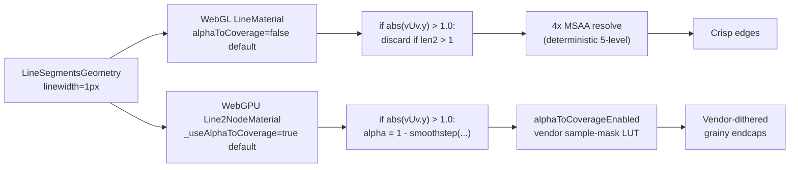
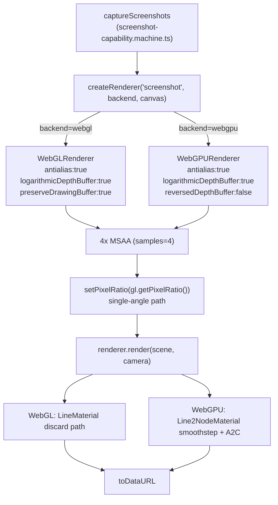

# WebGPU edge-line crispness gap

Investigation of why fat edge lines from `apps/ui/app/components/geometry/graphics/three/materials/gltf-edges.ts` render visibly grainier on WebGPU than on WebGL in the screenshot pipeline (`apps/ui/app/machines/screenshot-capability.machine.ts`), and the mechanical changes needed to bring WebGPU up to parity. This document is intended as a blueprint for a follow-up implementation plan; nothing here changes shipping behaviour.

## Executive Summary

The two backends ship with **inverted defaults for `alphaToCoverage`** on the line material. Upstream three's `LineMaterial` (WebGL) defaults `alphaToCoverage = false`, so endcap fragments take the deterministic MSAA-only `discard` path; upstream `Line2NodeMaterial` (WebGPU) defaults `_useAlphaToCoverage = true`, so endcap fragments take the smoothstep + hardware alpha-to-coverage path. The WebGPU spec leaves the alpha-to-sample-mask conversion vendor-defined; on hardware that uses spatial dithering (e.g. Qualcomm's documented 4×4 area-dither LUT, gpuweb/gpuweb#4867) this surfaces as the visible graininess in the screenshot. Every other plumbing axis — MSAA sample count, DPR / `viewport` / `screenDPR`, internal sRGB framebuffer target, log-depth encoding, software clipping — is already at parity for the screenshot pipeline. The proposed fix is a single line: opt the WebGPU edge material out of `alphaToCoverage` so it joins WebGL on the MSAA-only `discard` path.

## Table of Contents

1. [Problem Statement](#problem-statement)
2. [Methodology](#methodology)
3. [Findings](#findings)
4. [Recommendations](#recommendations)
5. [Trade-offs](#trade-offs)
6. [Code Examples](#code-examples)
7. [Diagrams](#diagrams)
8. [References](#references)

## Problem Statement

User-reported symptom (image evidence, 2026-05-12): a WebGPU screenshot of a windmill model produced via the screenshot capability machine shows visibly grainy / speckled edge lines, particularly noticeable around the cone, the wooden tower, and the sails. The same scene captured on the WebGL backend in the screenshot pipeline produces visibly crisper, smoother edges. The grainier WebGPU edges make it materially harder for the chat-based LLM to identify boundaries between parts when reasoning over screenshots.

In-scope question: **what mechanical differences between the WebGL and WebGPU rendering paths cause the crispness gap, and what is the minimal change set that closes it without altering the deliberate per-renderer depth-buffer divergence?**

Explicit invariants (out of scope):

- The WebGL viewport keeps `logarithmicDepthBuffer: true` (no reversed-Z).
- The WebGPU viewport keeps `reversedDepthBuffer: true, logarithmicDepthBuffer: false` (GTAO benefits per `docs/policy/webgpu-rendering-pipeline.md`).
- Both `screenshot` and `offscreen` WebGPU renderers keep `logarithmicDepthBuffer: true, reversedDepthBuffer: false` (uniform precision for large CAD models).
- The depth-buffer divergence stays — `apps/ui/app/components/geometry/graphics/three/materials/line2.material.ts` already routes per-renderer `setupDepth` correctly (see `docs/research/webgpu-fat-line-renderer-aware-depth.md`).

Scope: **the screenshot pipeline only**, since that is where the user observed the regression. The viewport pipeline runs through a different post-processing path (GTAO + `RenderPipeline`) and is not in this investigation's frame.

## Methodology

1. Read every screenshot-pipeline-relevant file in the workspace: `apps/ui/app/machines/screenshot-capability.machine.ts`, `apps/ui/app/components/geometry/graphics/three/renderer.ts`, `apps/ui/app/components/geometry/graphics/three/materials/gltf-edges.ts`, `apps/ui/app/components/geometry/graphics/three/materials/line2.material.ts`.
2. Read the upstream three.js r184 sources backing each path: `node_modules/three/examples/jsm/lines/LineMaterial.js`, `node_modules/three/examples/jsm/lines/LineSegments2.js`, `node_modules/three/examples/jsm/lines/webgpu/LineSegments2.js`, `node_modules/three/src/materials/nodes/Line2NodeMaterial.js`, `node_modules/three/src/materials/nodes/NodeMaterial.js`, `node_modules/three/src/renderers/common/Renderer.js`, `node_modules/three/src/renderers/webgpu/WebGPUBackend.js`, `node_modules/three/src/renderers/webgpu/utils/WebGPUUtils.js`, `node_modules/three/src/nodes/display/ScreenNode.js`, `node_modules/three/src/nodes/accessors/ClippingNode.js`, `node_modules/three/src/nodes/display/ToneMappingNode.js`.
3. Cross-checked `currentSamples` getter semantics, internal-framebuffer-target gating (`needsFrameBufferTarget`), and the timing of `Line2NodeMaterial.setup()` relative to `setRenderTarget(frameBufferTarget)` in `_renderScene` to rule out the "alpha-to-coverage path was never compiled in" hypothesis.
4. Web research on alpha-to-coverage hardware behaviour and three.js community reports: kai.graphics alpha-to-coverage emulator, gpuweb/gpuweb#4867 (Qualcomm spatial dither), gpuweb/gpuweb#3982 (validation and behaviour variance), three.js #21451 (Line2 alphaToCoverage origin), #22172 (smoothstep AA add), #30343 (1px line AA), #32229 (`LineMaterial` vs `Line2NodeMaterial` parity), #32583 / #32778 (log-depth integration with `Line2NodeMaterial`).
5. Compared the two factories' constructor parameters side-by-side to identify any default-value divergence that propagates into the AA strategy at runtime.

## Findings

### Finding 1 — `alphaToCoverage` default inversion is the smoking gun

**Evidence — WebGL side.** Upstream `LineMaterial`'s constructor leaves the `defines.USE_ALPHA_TO_COVERAGE` flag unset by default; the property is only enabled when a caller explicitly assigns `material.alphaToCoverage = true`:

```javascript
// node_modules/three/examples/jsm/lines/LineMaterial.js (constructor, around L428-453)
constructor( parameters ) {
  super( {
    type: 'LineMaterial',
    uniforms: UniformsUtils.clone( ShaderLib[ 'line' ].uniforms ),
    vertexShader: ShaderLib[ 'line' ].vertexShader,
    fragmentShader: ShaderLib[ 'line' ].fragmentShader,
    clipping: true
  } );
  this.isLineMaterial = true;
  this.setValues( parameters );
}
```

```glsl
// LineMaterial fragment shader, screen-space endcap branch (around L361-389)
#ifdef USE_ALPHA_TO_COVERAGE
  // smoothstep alpha (only compiled in when alphaToCoverage = true)
  float a = vUv.x;
  float b = ( vUv.y > 0.0 ) ? vUv.y - 1.0 : vUv.y + 1.0;
  float len2 = a * a + b * b;
  float dlen = fwidth( len2 );
  if ( abs( vUv.y ) > 1.0 ) {
    alpha = 1.0 - smoothstep( 1.0 - dlen, 1.0 + dlen, len2 );
  }
#else
  // discard path (default)
  if ( abs( vUv.y ) > 1.0 ) {
    float a = vUv.x;
    float b = ( vUv.y > 0.0 ) ? vUv.y - 1.0 : vUv.y + 1.0;
    float len2 = a * a + b * b;
    if ( len2 > 1.0 ) discard;
  }
#endif
```

Tau's WebGL factory does not set `alphaToCoverage`, so the `discard` branch is the active one:

```161:198:apps/ui/app/components/geometry/graphics/three/materials/gltf-edges.ts
function createEdgeLineMaterial(resolution: Vector2): LineMaterial {
  const material = new LineMaterial({
    color: defaultEdgeColor,
    linewidth: defaultLineWidth,
    worldUnits: false, // Screen-space pixels
    resolution: resolution.clone(),
    // Keep depth test enabled for proper occlusion
  });

  const depthBiasUniform = { value: depthBiasFactor };

  material.onBeforeCompile = (shader) => {
    shader.uniforms['depthBias'] = depthBiasUniform;
    // ... log-depth bias injection (does not touch alphaToCoverage)
  };

  return material;
}
```

**Evidence — WebGPU side.** Upstream `Line2NodeMaterial`'s constructor flips the default the other way:

```javascript
// node_modules/three/src/materials/nodes/Line2NodeMaterial.js (constructor body, L116-120)
this.blending = NoBlending;
this._useDash = parameters.dashed;
this._useAlphaToCoverage = true;
this._useWorldUnits = false;
```

When `_useAlphaToCoverage` is `true` and the renderer reports MSAA samples, the screen-space rounded-endcap branch substitutes the smoothstep alpha for the discard:

```javascript
// node_modules/three/src/materials/nodes/Line2NodeMaterial.js (L394-425, paraphrased)
} else { // round endcaps, screen-space (worldUnits = false)
  if ( useAlphaToCoverage && renderer.currentSamples > 0 ) {
    const a = vUv.x;
    const b = vUv.y.greaterThan( 0.0 ).select( vUv.y.sub( 1.0 ), vUv.y.add( 1.0 ) );
    const len2 = a.mul( a ).add( b.mul( b ) );
    const dlen = float( len2.fwidth() ).toVar( 'dlen' );
    If( vUv.y.abs().greaterThan( 1.0 ), () => {
      alpha.assign( smoothstep( dlen.oneMinus(), dlen.add( 1 ), len2 ).oneMinus() );
    } );
  } else {
    If( vUv.y.abs().greaterThan( 1.0 ), () => {
      // hard discard path (when alphaToCoverage is off OR samples == 0)
      const a = vUv.x;
      const b = vUv.y.greaterThan( 0.0 ).select( vUv.y.sub( 1.0 ), vUv.y.add( 1.0 ) );
      const len2 = a.mul( a ).add( b.mul( b ) );
      len2.greaterThan( 1.0 ).discard();
    } );
  }
}
```

Tau's WebGPU factory does not override the default, so `_useAlphaToCoverage` stays `true` and the smoothstep branch is the active one:

```317:327:apps/ui/app/components/geometry/graphics/three/materials/gltf-edges.ts
export function createWebGpuGltfFatLineMaterial(): Line2NodeMaterial {
  const material = new Line2NodeMaterial({
    color: defaultEdgeColor,
    linewidth: defaultLineWidth,
    worldUnits: false,
  });

  material.depthBias = depthBiasFactor;

  return material;
}
```

**Why the smoothstep + hardware alpha-to-coverage produces graininess.** Three's `WebGPUBackend` propagates `material.alphaToCoverage` into the WebGPU pipeline descriptor's `multisample.alphaToCoverageEnabled` flag. The WebGPU spec leaves the alpha-to-sample-mask conversion implementation-defined; gpuweb/gpuweb#4867 documents Qualcomm hardware using a 4×4 area-dither LUT that produces "spatial noise rather than strictly monotonic coverage". On any device whose driver picks a dithered translation (versus a pure threshold ladder), endcap fragments emit a sample mask that varies pixel-to-pixel even when the underlying alpha changes smoothly, producing the speckled / grainy edges visible in the user's screenshot.

The WebGL `discard` branch is immune because the geometric mask it produces is binary per sample and resolves to a deterministic 5-level coverage at 4× MSAA (`0/4, 1/4, 2/4, 3/4, 4/4`), with no driver-level alpha-to-mask translation.

### Finding 2 — Endcap-only branching is enough to grain the entire perceived edge

The smoothstep branch is gated by `If( vUv.y.abs().greaterThan( 1.0 ), ... )`, i.e. it only runs on the rounded endcap quads at the start and end of each segment. For a `LineSegmentsGeometry` built from BREP edges, every individual edge segment has its own pair of endcaps — and at `defaultLineWidth = 1` (1 logical pixel) the endcap occupies a non-trivial fraction of the line's rasterized footprint at typical screenshot DPRs. Where many short edge segments meet (corners, around the windmill cone tip, sail edges), endcap pixels stack along the visible silhouette. The result is what the user describes as graininess across the entire line, even though the sides of any individual segment quad are still rasterized opaquely.

### Finding 3 — `Line2NodeMaterial.setup()` runs after the MSAA target is bound, so `currentSamples > 0` always evaluates true

`NodeMaterial.build` invokes `setup()` (`node_modules/three/src/materials/nodes/NodeMaterial.js` L455-458). During `_renderScene`, the renderer binds the internal sRGB conversion target before object dispatch:

```javascript
// node_modules/three/src/renderers/common/Renderer.js (L1447-1455)
if (frameBufferTarget !== null) {
  renderTarget = frameBufferTarget;
  this.setRenderTarget(renderTarget);
} else {
  // ...
}
```

That target carries `samples = this.samples` (4 when `antialias: true`), so the `currentSamples` getter:

```javascript
// node_modules/three/src/renderers/common/Renderer.js (L2425-2460)
get currentSamples() {
  let samples = this._samples;
  if ( this._renderTarget !== null ) {
    samples = this._renderTarget.samples;
  } else if ( this.needsFrameBufferTarget ) {
    samples = 0;
  }
  return samples;
}
```

returns `4` at the moment `Line2NodeMaterial.setup()` compiles the graph. The smoothstep branch is therefore _always_ compiled in for `antialias: true` WebGPU screenshot renderers — it is not a "missed branch" bug, it is the wrong branch for our use case.

### Finding 4 — Non-causes, recorded so the follow-up plan does not chase ghosts

| Axis                                             | WebGL screenshot                                                                                                                                                                          | WebGPU screenshot                                                                                                                                                                                                        | Verdict                                                                 |
| ------------------------------------------------ | ----------------------------------------------------------------------------------------------------------------------------------------------------------------------------------------- | ------------------------------------------------------------------------------------------------------------------------------------------------------------------------------------------------------------------------ | ----------------------------------------------------------------------- |
| `antialias` flag                                 | `true` ([renderer.ts L84-99](apps/ui/app/components/geometry/graphics/three/renderer.ts))                                                                                                 | `true` ([renderer.ts L62-68](apps/ui/app/components/geometry/graphics/three/renderer.ts))                                                                                                                                | At parity                                                               |
| MSAA sample count                                | 4 (driver default for `antialias: true`)                                                                                                                                                  | 4 (`_samples` from `Renderer.js` L268, clamped by `WebGPUUtils.getSampleCount` L201-213)                                                                                                                                 | At parity                                                               |
| `currentSamples` at material compile             | n/a (WebGL pipeline doesn't query it)                                                                                                                                                     | 4 (internal sRGB FB bound first, see Finding 3)                                                                                                                                                                          | Not the cause                                                           |
| Pixel ratio                                      | `gl.getPixelRatio()` for single-angle, `1` for composite ([screenshot-capability.machine.ts L562-569](apps/ui/app/machines/screenshot-capability.machine.ts))                             | identical (same code path, same renderer instance type)                                                                                                                                                                  | At parity                                                               |
| Line width math                                  | `offset *= linewidth; offset /= resolution.y;` (logical pixels via `LineSegments2.onBeforeRender` writing `material.uniforms.resolution` from `getViewport`, `LineSegments2.js` L411-422) | `offset *= materialLineWidth; offset /= viewport.w / screenDPR;` (logical pixels via `ScreenNode.update` reading `getPixelRatio()`, `ScreenNode.js` L110-145)                                                            | Algebraically identical                                                 |
| `LineSegments2.onBeforeRender`                   | Updates `material.uniforms.resolution` from current viewport                                                                                                                              | Stores `_resolution` for raycasting only; runtime line width comes from TSL `viewport`/`screenDPR` ([webgpu/LineSegments2.js L303-308](node_modules/three/examples/jsm/lines/webgpu/LineSegments2.js))                   | Different mechanism, same result                                        |
| Depth buffer flavour                             | `logarithmicDepthBuffer: true`                                                                                                                                                            | `logarithmicDepthBuffer: true` (screenshot-only; viewport diverges)                                                                                                                                                      | At parity for the screenshot path                                       |
| Depth encoding routing                           | `<logdepthbuf_vertex>` chunk + tau bias                                                                                                                                                   | Tau `Line2NodeMaterial.setupDepth(builder)` dispatching on `builder.renderer.logarithmicDepthBuffer` ([line2.material.ts L148-179](apps/ui/app/components/geometry/graphics/three/materials/line2.material.ts))          | Already fixed (`docs/research/webgpu-fat-line-renderer-aware-depth.md`) |
| Coplanar bias                                    | `depthBiasFactor = 0.999` ([gltf-edges.ts L48](apps/ui/app/components/geometry/graphics/three/materials/gltf-edges.ts))                                                                   | Same constant forwarded as `material.depthBias`                                                                                                                                                                          | At parity                                                               |
| Hardware clipping                                | `LineMaterial` uses fragment-stage clipping by default                                                                                                                                    | Tau forces `hardwareClipping = false` in `setupHardwareClipping` ([line2.material.ts L128-130](apps/ui/app/components/geometry/graphics/three/materials/line2.material.ts)); only matters when section planes are active | At parity for default views                                             |
| Tone mapping                                     | `NoToneMapping` on screenshot ([screenshot-capability.machine.ts L572](apps/ui/app/machines/screenshot-capability.machine.ts))                                                            | Same                                                                                                                                                                                                                     | At parity                                                               |
| Output color space                               | `gl.outputColorSpace` (sRGB)                                                                                                                                                              | Same                                                                                                                                                                                                                     | At parity                                                               |
| Alpha preservation through tone-map / colorspace | n/a; `LineMaterial` writes `gl_FragColor` directly                                                                                                                                        | `ToneMappingNode.setup` returns `vec4(toneMappingFn(rgb, exp), colorNode.a)` and `ColorSpaceNode` preserves `a`                                                                                                          | At parity                                                               |

### Finding 5 — `blending = NoBlending` plus default `transparent = false` does not force alpha=1

Three's `Line2NodeMaterial` constructor sets `this.blending = NoBlending`. `NodeBuilder.isOpaque()` only short-circuits `diffuseColor.a = 1` when _all three_ of `transparent === false`, `blending === NormalBlending`, and `alphaToCoverage === false` hold:

```javascript
// node_modules/three/src/nodes/core/NodeBuilder.js (L488-494)
isOpaque() {
  const material = this.material;
  return material.transparent === false && material.blending === NormalBlending && material.alphaToCoverage === false;
}
```

Because `blending` is `NoBlending` (not `NormalBlending`) and `alphaToCoverage` defaults to `true`, `isOpaque()` returns `false` and the smoothstep alpha is allowed to propagate to the alpha-to-coverage stage. Setting `material.alphaToCoverage = false` does not by itself flip `isOpaque()` to true (`blending` is still `NoBlending`), but it does take the alpha-to-coverage stage out of the picture entirely, which is the only stage that matters for the grain.

## Recommendations

| #   | Action                                                                                                                                                                                                                                          | Priority | Effort  | Impact                                              | Status                                                                                                                                                                                                                                                         |
| --- | ----------------------------------------------------------------------------------------------------------------------------------------------------------------------------------------------------------------------------------------------- | -------- | ------- | --------------------------------------------------- | -------------------------------------------------------------------------------------------------------------------------------------------------------------------------------------------------------------------------------------------------------------- |
| R1  | Set `material.alphaToCoverage = false` in `createWebGpuGltfFatLineMaterial` so WebGPU joins WebGL on the deterministic MSAA-only `discard` path.                                                                                                | P0       | Trivial | High — eliminates vendor-dithered endcap noise      | RESOLVED ([gltf-edges.ts](apps/ui/app/components/geometry/graphics/three/materials/gltf-edges.ts), regression-guard test in [gltf-edges-webgpu.material.test.ts](apps/ui/app/components/geometry/graphics/three/materials/gltf-edges-webgpu.material.test.ts)) |
| R2  | Add a Playwright parity test under `apps/ui-e2e/src/` that screenshots a 1px-wide GLTF cube edge with both backends and asserts a luminance-histogram delta below a small threshold.                                                            | P1       | Low     | Medium — locks in the parity contract once R1 lands | OPEN                                                                                                                                                                                                                                                           |
| R3  | Document the `alphaToCoverage` choice in `docs/policy/webgpu-rendering-pipeline.md` so future kernels and overlay materials inherit the same default.                                                                                           | P1       | Trivial | Medium                                              | OPEN                                                                                                                                                                                                                                                           |
| R4  | Defer: investigate replacing the smoothstep + alpha-to-coverage path with an explicit `outputNode` that performs analytical edge AA without alpha-to-coverage, only if R1 reveals visible quantisation at very high zoom on supported hardware. | P3       | Medium  | Low (only relevant if R1 is insufficient)           | DEFERRED                                                                                                                                                                                                                                                       |

## Trade-offs

- **R1 disables analytical endcap smoothing.** With 4× MSAA the `discard` path produces 5 deterministic coverage levels per pixel; at `linewidth = 1` (Tau's `defaultLineWidth`) this is visually indistinguishable from analytical AA. Wider lines (>3 px) would show coarser endcap quantisation, but Tau does not currently render wide edges and could revisit per-material if that ever changes.
- **Why not just bump `linewidth`?** Larger lines hide the dithering by oversampling but do not address the underlying alpha-to-coverage translation; they also inflate the on-screen edge thickness in a way that breaks the visual contract with the viewport.
- **Why not enable `alphaToCoverage` on the WebGL side too?** Possible in principle, but WebGL is the crisp baseline today; aligning by enabling alpha-to-coverage on WebGL would import the same vendor-dependent dithering and regress the working backend.
- **Why not switch screenshot WebGPU to `logarithmicDepthBuffer: false, reversedDepthBuffer: true` to mirror the viewport?** Out of scope for this investigation — `docs/policy/webgpu-rendering-pipeline.md` keeps log-depth on the screenshot path for uniform precision across large CAD models, and the line-rendering crispness gap is independent of the depth-buffer flavour (Finding 4).
- **Why not just override `Line2NodeMaterial.colorNode` in the Tau subclass to drop the smoothstep branch entirely?** That is option R4. It is more invasive than a single-property assignment and ties Tau's subclass to upstream's `colorNode` body, which would need to be re-ported on every three.js bump (the same maintenance cost as the existing `setup()` port already documented in [`line2.material.ts`](apps/ui/app/components/geometry/graphics/three/materials/line2.material.ts)). R1 is preferred because it expresses the same intent with one assignment and lets `Line2NodeMaterial.setup()`'s existing `else` branch handle the discard.

## Code Examples

### WebGPU factory after R1 (current)

```typescript
export function createWebGpuGltfFatLineMaterial(): Line2NodeMaterial {
  const material = new Line2NodeMaterial({
    color: defaultEdgeColor,
    linewidth: defaultLineWidth,
    worldUnits: false,
  });

  material.alphaToCoverage = false;
  material.depthBias = depthBiasFactor;

  return material;
}
```

The setter at `Line2NodeMaterial` flips both `_useAlphaToCoverage` and `needsUpdate`, so the next graph rebuild picks up the `discard` branch. No subclass changes were required; the regression guard lives in [`gltf-edges-webgpu.material.test.ts`](apps/ui/app/components/geometry/graphics/three/materials/gltf-edges-webgpu.material.test.ts) (`opts out of alphaToCoverage to match WebGL crispness`).

### Reference: WebGL factory (status quo)

```161:198:apps/ui/app/components/geometry/graphics/three/materials/gltf-edges.ts
function createEdgeLineMaterial(resolution: Vector2): LineMaterial {
  const material = new LineMaterial({
    color: defaultEdgeColor,
    linewidth: defaultLineWidth,
    worldUnits: false, // Screen-space pixels
    resolution: resolution.clone(),
    // Keep depth test enabled for proper occlusion
  });

  const depthBiasUniform = { value: depthBiasFactor };

  material.onBeforeCompile = (shader) => {
    shader.uniforms['depthBias'] = depthBiasUniform;

    shader.vertexShader = shader.vertexShader.replace(
      '#include <logdepthbuf_pars_vertex>',
      `#include <logdepthbuf_pars_vertex>
      uniform float depthBias;`,
    );

    shader.vertexShader = shader.vertexShader.replace(
      '#include <logdepthbuf_vertex>',
      `#include <logdepthbuf_vertex>
      #ifdef USE_LOGARITHMIC_DEPTH_BUFFER
        if (projectionMatrix[3][3] == 0.0) {
          float tanHalfFov = 1.0 / projectionMatrix[1][1];
          float fovScale = tanHalfFov / 0.57735;
          vFragDepth *= pow(depthBias, fovScale);
        }
      #endif`,
    );
  };

  material.userData['depthBiasUniform'] = depthBiasUniform;

  return material;
}
```

Note the absence of `alphaToCoverage: true` — that is precisely why WebGL is crisp today.

## Diagrams

### AA strategy divergence



### Screenshot pipeline shared infrastructure (everything else is at parity)



## References

- three.js #21451 — original Line2 alphaToCoverage PR
- three.js #22172 — alphaToCoverage smoothstep AA add for clipping/alpha-test
- three.js #30343 — 1px lines aren't antialiased properly (background)
- three.js #32229 — `LineMaterial` vs `Line2NodeMaterial` parity tracking issue
- three.js #32583 — `Line2NodeMaterial` incompatible with logarithmic depth buffer (background; addressed by `docs/research/webgpu-fat-line-renderer-aware-depth.md`)
- three.js #32778 — `Line2NodeMaterial` log-depth support follow-up
- gpuweb/gpuweb#4867 — alpha-to-coverage spec and conformance on Qualcomm hardware (4×4 area-dither LUT documented)
- gpuweb/gpuweb#3982 — alpha-to-coverage validation and behaviour (vendor variance discussion)
- kai.graphics alpha-to-coverage emulator — visual demonstration of 4×MSAA quantisation
- toji.dev WebGPU/WebGL performance comparison best practices
- Related: `docs/research/webgpu-fat-line-renderer-aware-depth.md`
- Related: `docs/research/webgpu-fat-line-hardware-clipping-bug.md`
- Related: `docs/research/webgpu-line2-reversed-z-trim.md`
- Related: `docs/research/gltf-edges-line-rendering-regression.md`
- Policy: `docs/policy/webgpu-rendering-pipeline.md`
- Policy: `docs/policy/graphics-backend-policy.md`
