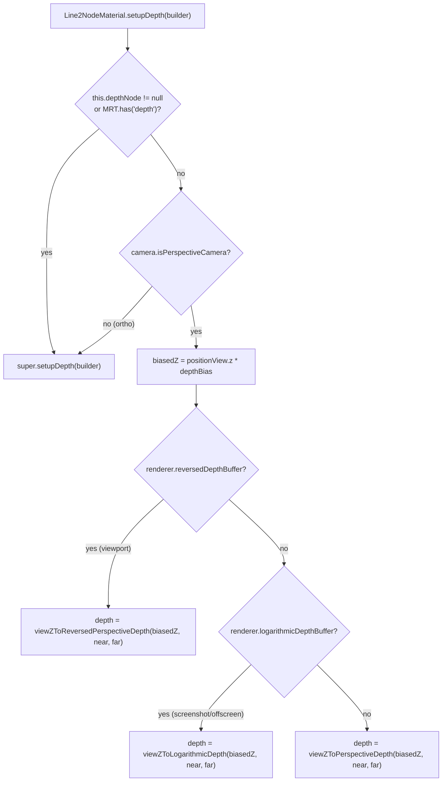

# WebGPU fat-line renderer-aware depth encoding

Root-cause investigation of a screenshot regression where occluded GLTF edge lines render through opaque surfaces on WebGPU screenshots while the same model occludes correctly in the live WebGPU viewport.

## Executive Summary

- **Symptom (image evidence, 2026-05-12).** Saving a screenshot via `apps/ui/app/machines/screenshot-capability.machine.ts` on the WebGPU backend produces a PNG where edge lines that should be hidden behind the front of a solid leak through it as a wireframe X-ray. The live WebGPU viewport renders the same model correctly. WebGL screenshots are unaffected.
- **Smoking gun.** `apps/ui/app/components/geometry/graphics/three/materials/gltf-edges.ts` previously hardcoded `material.depthNode = viewZToReversedPerspectiveDepth(positionView.z.mul(0.999), cameraNear, cameraFar)` on every WebGPU `Line2NodeMaterial`. The viewport renderer runs with `reversedDepthBuffer: true` so the encoded depth matched the surface rasterizer, but the screenshot/offscreen renderers run with `reversedDepthBuffer: false, logarithmicDepthBuffer: true`. Surfaces in those renderers fall through to `NodeMaterial.setupDepth` and emit `viewZToLogarithmicDepth(...)` (`[0..1]` log-space). Lines kept emitting `viewZToReversedPerspectiveDepth(...)` (`[1..0]` reversed-perspective). The depth comparison breaks: every occluded line fragment produces a smaller depth than the surface in front of it and wins the `LessDepth` test.
- **Architectural rule.** Tau intentionally configures three different WebGPU renderer presets in `apps/ui/app/components/geometry/graphics/three/renderer.ts` (`viewport`, `offscreen`, `screenshot`) with divergent depth-buffer settings tuned per use case. Materials that override `depthNode` MUST dispatch on `builder.renderer.reversedDepthBuffer` / `builder.renderer.logarithmicDepthBuffer`, mirroring three.js's own `PointShadowNode` and `NodeMaterial.setupDepth` patterns. Hardcoding a single encoder at construction time is brittle whenever the same material instance can be consumed by more than one renderer in the same frame budget.
- **Surgical fix (landed).** The existing `Line2NodeMaterial` subclass in `apps/ui/app/components/geometry/graphics/three/materials/line2.material.ts` already overrides several aspects of the upstream class. It now exposes a `depthBias` field and a `setupDepth(builder)` override that picks the matching `viewZTo*Depth` encoder from the renderer flags and applies the bias multiplier consistently across all three encodings. The `gltf-edges.ts` factory sets `material.depthBias` instead of `material.depthNode`. Orthographic cameras, MRT depth attachments, and call sites that have manually set `material.depthNode` delegate to `super.setupDepth(builder)` so the upstream decision tree stays authoritative.

## Problem Statement

User-reported symptoms (image evidence captured 2026-05-12):

1. **WebGPU live viewport** renders edge lines correctly: lines coplanar with surfaces are visible (so the model retains its CAD-style edge detail), and lines occluded behind surfaces are hidden.
2. **WebGPU screenshot** (saved via the screenshot capability machine) renders the same model with the OPPOSITE behavior on occluded edges: lines that ought to be hidden behind a surface render through as a wireframe ghost.
3. **WebGL viewport** and **WebGL screenshot** both render correctly. Only the WebGPU screenshot path regressed.

The previously landed transparent-sort fix (`docs/research/webgpu-reversed-z-transparent-sort-inversion.md`) addressed a related but distinct WebGPU-only symptom: section-view selector labels rendering in the wrong slot. That fix touches only the viewport's transparent-object sort and does not affect the screenshot depth path.

## Methodology

1. **Confirm renderer divergence.** Read `createRenderer` to compare WebGPU options across the three use cases.
2. **Trace `depthNode` assignment.** Locate every assignment to `material.depthNode` on `Line2NodeMaterial` instances in the UI codebase via `Grep`.
3. **Map three.js depth pipeline.** Read `node_modules/three/src/materials/nodes/NodeMaterial.js` (`setupDepth`) and `node_modules/three/src/nodes/display/ViewportDepthNode.js` (the `viewZTo*Depth` encoders) to confirm what surfaces actually emit per renderer flag.
4. **Confirm canonical pattern.** Read `node_modules/three/src/nodes/lighting/PointShadowNode.js` to verify three.js itself dispatches on `builder.renderer.reversedDepthBuffer` for shadow depth.

## Findings

### Finding 1: The renderer factory ships three distinct WebGPU configurations

`apps/ui/app/components/geometry/graphics/three/renderer.ts` (`createRenderer`) constructs renderers per use case:

| Use case     | `reversedDepthBuffer` | `logarithmicDepthBuffer` | Notes                                                   |
| ------------ | --------------------- | ------------------------ | ------------------------------------------------------- |
| `viewport`   | `true`                | `false`                  | GTAO benefits from reversed-Z; bounded camera frustum.  |
| `offscreen`  | `false`               | `true`                   | Bitmap export path; uniform precision for large models. |
| `screenshot` | `false`               | `true`                   | Headless readback path; same precision rationale.       |

`docs/policy/graphics-backend-policy.md` declares this divergence intentional and `docs/policy/webgpu-rendering-pipeline.md` documents the perf rationale. Materials that participate in all three paths cannot pick a single depth encoder at construction time.

### Finding 2: Surfaces auto-adapt; the line factory did not

`NodeMaterial.setupDepth` (`node_modules/three/src/materials/nodes/NodeMaterial.js`) only assigns a `depthNode` when `this.depthNode === null`. The fallback chain consults `renderer.getMRT()` and `renderer.logarithmicDepthBuffer` and ultimately picks `viewZToLogarithmicDepth` for perspective + log-depth or `viewZToOrthographicDepth` for ortho + log-depth. Standard non-log non-reversed runs leave `depthNode` `null`, in which case the rasterizer's default clip-space `gl_FragCoord.z` writes the depth buffer.

Three.js does NOT have a built-in reversed-Z branch in `NodeMaterial.setupDepth`. Reversed-Z is opt-in per material via explicit `material.depthNode = viewZToReversedPerspectiveDepth(...)`.

The factory in `gltf-edges.ts` set `material.depthNode` unconditionally to the reversed-Z encoder so the line bias would compose with the viewport's reversed-Z surface depth. That worked for the viewport. It broke the screenshot path because the encoder no longer matched the renderer.

### Finding 3: Three.js's own canonical pattern is renderer-aware dispatch

`PointShadowNode` (`node_modules/three/src/nodes/lighting/PointShadowNode.js`) faces the same problem (shadow caster depth must match the active renderer's depth-buffer convention) and resolves it by branching inside the TSL graph callback:

```javascript
if (builder.renderer.reversedDepthBuffer) {
  coordZ = viewZToReversedPerspectiveDepth(/* ... */);
} else {
  coordZ = viewZToPerspectiveDepth(/* ... */);
}
```

`NodeMaterial.setupDepth` follows the same `builder.renderer.*` pattern for the log-depth branch. Anything that overrides depth encoding outside `material.depthNode` should mirror this dispatch shape.

### Finding 4: A single material instance can be consumed by multiple renderers

The screenshot capability machine reuses scene graphs across the live viewport and the headless capture pipeline. Even when the renderer is distinct between the two, the underlying `Line2NodeMaterial` instances may not be cloned. Setting `this.depthNode` from a factory at construction time encodes a single renderer's assumption into the material, then breaks any time the same instance is rendered by a renderer with different depth flags. The fix must therefore react to the active `builder` rather than a construction-time fact.

### Finding 5: Bias preservation requires a renderer-aware path on every encoding

The 0.999 multiplier on `positionView.z` is a coplanar-edge bias: it pulls the line forward in view-space (smaller `|z|` because view-space Z is negative for objects in front of the camera) so the line wins the depth comparison against the surface it overlays. For correctness, the bias must be applied in whichever space the renderer's surfaces are using:

| Renderer state                 | Encoder picked                    | Bias point                                                         |
| ------------------------------ | --------------------------------- | ------------------------------------------------------------------ |
| `reversedDepthBuffer: true`    | `viewZToReversedPerspectiveDepth` | `positionView.z * depthBias` before encoding                       |
| `logarithmicDepthBuffer: true` | `viewZToLogarithmicDepth`         | `positionView.z * depthBias` before encoding (log-space monotonic) |
| Standard perspective (no flag) | `viewZToPerspectiveDepth`         | `positionView.z * depthBias` before encoding                       |

In all three cases the bias multiplier composes correctly: smaller `|z|` produces smaller encoded depth (closer to camera), which wins `LessDepth`. Skipping the bias on the log-depth path was an option (rejected — would break coplanar edges in screenshots, regression-equivalent to the WebGL pre-bias behavior); preserving it was the architecturally complete choice and is also free since three.js exposes `viewZToLogarithmicDepth` from `three/tsl` for direct reuse.

## Recommendations

| #   | Action                                                                                                                                         | Priority | Effort  | Impact |
| --- | ---------------------------------------------------------------------------------------------------------------------------------------------- | -------- | ------- | ------ |
| R1  | Override `setupDepth(builder)` on `Line2NodeMaterial`; dispatch on `builder.renderer.reversedDepthBuffer` / `logarithmicDepthBuffer`.          | P0       | Low     | High   |
| R2  | Expose `depthBias` as a public field on the subclass; apply to `positionView.z` consistently across all three encoders.                        | P0       | Low     | High   |
| R3  | Drop `material.depthNode = viewZToReversedPerspectiveDepth(...)` from the gltf-edges factory; set `material.depthBias = 0.999` instead.        | P0       | Low     | High   |
| R4  | Delegate orthographic cameras and MRT depth attachments to `super.setupDepth(builder)` so the upstream decision tree stays authoritative.      | P1       | Low     | Medium |
| R5  | Add regression-guard tests that assert each renderer flag combination picks the right encoder; capture via patched `depth.assign` interceptor. | P1       | Low     | Medium |
| R6  | When future kernels or capture paths add new renderer presets, they get correct depth encoding for free; no per-call-site coordination needed. | P2       | Trivial | Medium |

R1-R5 land together in the same change set; the override on the subclass plus the factory rewire is one cohesive fix.

## Trade-offs

| Approach                                                                                                  | Correctness                        | DX                                                           | Verdict                                                      |
| --------------------------------------------------------------------------------------------------------- | ---------------------------------- | ------------------------------------------------------------ | ------------------------------------------------------------ |
| Hardcode `material.depthNode = viewZToReversedPerspectiveDepth(...)` per factory (status quo before fix). | Breaks screenshots/offscreen       | Simple but brittle                                           | Rejected                                                     |
| Skip `material.depthNode` on the log-depth path; rely on `NodeMaterial.setupDepth` fallback.              | Loses coplanar bias on screenshots | One-line change                                              | Rejected (regression-equivalent for coplanar edges)          |
| `setupDepth(builder)` override on the existing subclass dispatching all three encoders with bias.         | Correct on every renderer          | Self-contained, mirrors `PointShadowNode` pattern            | **Adopted**                                                  |
| Per-renderer factory variants (one factory per use case).                                                 | Correct                            | Multiplies factories, leaks renderer concern into edge layer | Rejected (factories shouldn't know about renderer use cases) |

## Code Examples

### Override on `Line2NodeMaterial`

`apps/ui/app/components/geometry/graphics/three/materials/line2.material.ts`:

```typescript
public depthBias = 1;

public override setupDepth(builder: unknown): void {
  const { renderer, camera } = builder as {
    readonly renderer: {
      readonly reversedDepthBuffer?: boolean;
      readonly logarithmicDepthBuffer?: boolean;
      getMRT?: () => { has(name: string): boolean } | null;
    };
    readonly camera: { readonly isPerspectiveCamera?: boolean };
  };

  const mrt = typeof renderer.getMRT === 'function' ? renderer.getMRT() : null;

  if (this.depthNode !== null || (mrt !== null && mrt.has('depth')) || camera.isPerspectiveCamera !== true) {
    super.setupDepth(builder);
    return;
  }

  const biasedZ = positionView.z.mul(this.depthBias);
  const depthNode = renderer.reversedDepthBuffer
    ? viewZToReversedPerspectiveDepth(biasedZ, cameraNear, cameraFar)
    : renderer.logarithmicDepthBuffer
      ? viewZToLogarithmicDepth(biasedZ, cameraNear, cameraFar)
      : viewZToPerspectiveDepth(biasedZ, cameraNear, cameraFar);

  depth.assign(depthNode).toStack();
}
```

### Factory rewire

`apps/ui/app/components/geometry/graphics/three/materials/gltf-edges.ts`:

```typescript
// Before
material.depthNode = viewZToReversedPerspectiveDepth(positionView.z.mul(depthBiasFactor), cameraNear, cameraFar);

// After
material.depthBias = depthBiasFactor;
```

## Diagrams



## Why the previous label-flip fix is unrelated

The label-flip fix landed in `docs/research/webgpu-reversed-z-transparent-sort-inversion.md` and registered a custom `reversedDepthTransparentSort` for the WebGPU `viewport` renderer only. It compensates for `reversePainterSortStable` assuming "larger clip-z = farther", which is INVERTED under reversed-Z. The fix:

- Touches `setTransparentSort` only on the viewport renderer (no effect on `screenshot`/`offscreen` because they don't have `reversedDepthBuffer: true`).
- Affects sort order, not depth-buffer encoding.
- Concerns transparent objects (`SectionViewControls` selectors with `depthTest: false`), not opaque edge lines.

The screenshot edge occlusion bug instead concerns the depth value emitted into the depth buffer by an opaque material. The two fixes are independent.

## References

- `apps/ui/app/components/geometry/graphics/three/renderer.ts` — Renderer factory with the three use-case presets.
- `apps/ui/app/components/geometry/graphics/three/materials/line2.material.ts` — Subclass with `setupDepth` override.
- `apps/ui/app/components/geometry/graphics/three/materials/gltf-edges.ts` — Edge-line factory using `material.depthBias`.
- `apps/ui/app/components/geometry/graphics/three/materials/line2.material.test.ts` — Regression-guard tests for each renderer flag combination.
- `node_modules/three/src/materials/nodes/NodeMaterial.js` — Upstream `setupDepth` pattern and log-depth fallback.
- `node_modules/three/src/nodes/lighting/PointShadowNode.js` — Canonical `builder.renderer.reversedDepthBuffer` dispatch precedent.
- `node_modules/three/src/nodes/display/ViewportDepthNode.js` — `viewZTo*Depth` encoder definitions.
- `docs/policy/graphics-backend-policy.md` — Renderer use-case policy.
- `docs/policy/webgpu-rendering-pipeline.md` — WebGPU pipeline policy (reversed-Z viewport vs log-depth screenshot rationale).
- `docs/research/webgpu-fat-line-hardware-clipping-bug.md` — Sibling subclass override on the same material (Divergence 2).
- `docs/research/webgpu-line2-reversed-z-trim.md` — Original subclass divergence (Divergence 1).
- `docs/research/webgpu-reversed-z-transparent-sort-inversion.md` — Independent fix for transparent label sort under reversed-Z.
