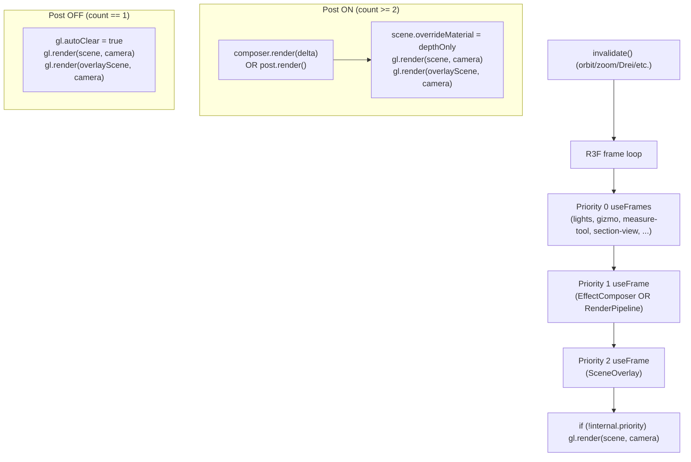

# WebGPU Render Loop and Shader Compile Audit

Audit of the `apps/ui` Three.js r18x dual WebGL/WebGPU viewer pipeline to identify what work is being repeated per frame, what triggers TSL/WGSL recompiles, and how the manual `gl.render` calls in `SceneOverlay` interact with R3F's render scheduler. The trigger was the user-visible "`Declaration name 'tauDdX' already in use`" warnings flooding the dev console during camera orbit.

## Executive Summary

The CAD viewer is correctly configured for **demand rendering** (`frameloop='demand'`, `dpr` clamped to 2). The redeclaration warnings are NOT caused by per-frame TSL recompiles — TSL `NodeBuilder.build()` runs once per `RenderObject.initialCacheKey` and `registerDeclaration` only fires from inside that build. The actual loop is:

1. The grid `Fn` body declares duplicate-named locals every time the grid material is built (already covered in [tsl-redeclaration-fix plan](../../.cursor/plans/tsl-redeclaration-fix_eaa095af.plan.md)).
2. `<Grid>` recreates the entire `MeshBasicNodeMaterial` every time camera-distance crosses a grid-decade boundary, because `materialProperties` is the `useMemo` dep and `uniform(value)` bakes values at construction. Each rebuild kicks off a fresh `NodeBuilder.build()`, which surfaces the redeclaration once per rebuild — and during continuous zoom these rebuilds chain back-to-back, looking like a per-frame storm in the console.
3. `SceneOverlay`'s manual `gl.render` calls are correct for the current architecture: in R3F 9.6.1 any positive-priority `useFrame` suppresses the auto-render, so SceneOverlay (priority 2) becomes the main-scene render owner whenever post-processing is off. The `else` branch (lines 64-68) is NOT dead code.
4. `scene.overrideMaterial = depthOnlyMaterial` does cause a small amount of per-mesh **pipeline cache** churn through `WebGPUBackend.needsRenderUpdate` (raster-state fingerprint), but does NOT trigger WGSL recompiles — pipelines are keyed on `(programIds, raster-state)` and programs are cached separately by shader-source identity.
5. Several smaller per-frame allocations and config drifts (lights `useFrame` Quaternion allocation, splashback canvas defaulting to `frameloop='always'`, props-spread footgun in `ThreeProvider`).

The single highest-impact fix is making the grid material long-lived (mutate `uniform(...)` `.value` instead of rebuilding) — it eliminates the warning storm, the per-zoom GPU pipeline rebuilds, and the JS-side material allocation churn in one shot.

## Table of Contents

- [Problem Statement](#problem-statement)
- [Methodology](#methodology)
- [Findings](#findings)
  - [Finding 1: Frameloop is correctly `demand`](#finding-1-frameloop-is-correctly-demand)
  - [Finding 2: Grid material is recreated on every camera-zoom decade](#finding-2-grid-material-is-recreated-on-every-camera-zoom-decade)
  - [Finding 3: TSL compile triggers — per build, not per draw](#finding-3-tsl-compile-triggers--per-build-not-per-draw)
  - [Finding 4: `state.internal.priority` is a count, not a max](#finding-4-stateinternalpriority-is-a-count-not-a-max)
  - [Finding 5: `SceneOverlay` `else` branch is reachable in production](#finding-5-sceneoverlay-else-branch-is-reachable-in-production)
  - [Finding 6: `scene.overrideMaterial` causes pipeline cache churn](#finding-6-sceneoverridematerial-causes-pipeline-cache-churn)
  - [Finding 7: Per-frame allocations in `lights.tsx`](#finding-7-per-frame-allocations-in-lightstsx)
  - [Finding 8: Empty-overlay-children footgun](#finding-8-empty-overlay-children-footgun)
  - [Finding 9: Splashback canvas runs `frameloop='always'`](#finding-9-splashback-canvas-runs-frameloopalways)
  - [Finding 10: Renderer-options drift across surfaces](#finding-10-renderer-options-drift-across-surfaces)
  - [Finding 11: `ThreeProvider` props spread can shadow `frameloop`/`gl`](#finding-11-threeprovider-props-spread-can-shadow-frameloopgl)
- [Render Ownership Diagram](#render-ownership-diagram)
- [Recommendations](#recommendations)
- [Trade-offs: alternative architectures](#trade-offs-alternative-architectures)
- [References](#references)

## Problem Statement

During camera orbit/zoom on a project page (`/projects/<id>`), the dev console fills with hundreds of `THREE.TSL: Declaration name 'tauDdX' already in use` warnings (also `tauDdY`, `tauDd`, `tauDeriv`, `tauTarget`, `tauDraw`, `tauAA`, `tauGridUv`, `tauGridAxes`). The user's screenshot showed the warnings repeating fast enough to suggest a per-frame issue. The previous investigation ([`.cursor/plans/tsl-redeclaration-fix_eaa095af.plan.md`](../../.cursor/plans/tsl-redeclaration-fix_eaa095af.plan.md)) identified the named-`.toVar` collision inside `pristineGridIntensity`, but did not explain why the warnings repeat so frequently or whether deeper render-loop work was being duplicated.

The questions for this audit:

1. Is the warning truly per-frame, or per-something-else?
2. Is the CAD viewer recompiling shaders every frame?
3. Is the manual `gl.render(...)` in `SceneOverlay` correct, redundant, or harmful?
4. What other repeated work happens on every demand frame, and where can we save cycles for a smoother experience?

## Methodology

Read-only source analysis across:

- [`apps/ui/app/components/geometry/graphics/three/**`](../../apps/ui/app/components/geometry/graphics/three/)
- [`apps/ui/app/components/geometry/graphics/three/canvas-three-gl.ts`](../../apps/ui/app/components/geometry/graphics/three/canvas-three-gl.ts)
- [`apps/ui/app/machines/graphics.machine.ts`](../../apps/ui/app/machines/graphics.machine.ts)
- `node_modules/three/build/three.webgpu.js` (r18x bundle)
- `node_modules/@react-three/fiber/dist/events-b389eeca.esm.js` (R3F 9.6.1)
- `node_modules/@react-three/postprocessing/src/EffectComposer.tsx`

Three parallel exploration subagents covered: R3F frameloop and `useFrame` inventory; Three.js TSL/WGSL compile triggers and `registerDeclaration` semantics; and `SceneOverlay` integration with the R3F priority model. No code was modified.

## Findings

### Finding 1: Frameloop is correctly `demand`

[`apps/ui/app/components/geometry/graphics/three/three-context.tsx`](../../apps/ui/app/components/geometry/graphics/three/three-context.tsx) line 171 sets `frameloop='demand'`. R3F's automatic loop only ticks when something calls `invalidate()` (orbit-controls damping, prop changes, manual hooks). The CAD viewer is NOT animating at 60 Hz when idle.

The splashback canvas in [`apps/ui/app/routes/auth.$/splashback/unified-splashback-viewer.tsx`](../../apps/ui/app/routes/auth.$/splashback/unified-splashback-viewer.tsx) line 773 omits `frameloop` and inherits the R3F default (`'always'`). This is appropriate for a continuously-animated marketing scene but is worth documenting since the policy doesn't currently call this out.

### Finding 2: Grid material is recreated on every camera-zoom decade

This is the smoking gun for the warning frequency.

```13:43:apps/ui/app/components/geometry/graphics/three/grid.tsx
export const Grid = React.memo(() => {
  const gridSizes = useGraphicsSelector((state) => state.context.gridSizes);
  const upDirection = useGraphicsSelector((state) => state.context.upDirection);
  const { theme } = useTheme();
  const { invalidate } = useThree();

  React.useEffect(() => {
    invalidate();
  }, [invalidate]);

  const gridColor = React.useMemo(
    () => (theme === Theme.LIGHT ? new THREE.Color('lightgrey') : new THREE.Color('grey')),
    [theme],
  );

  const axes = upDirection === 'x' ? 'zyx' : upDirection === 'y' ? 'xzy' : 'xyz';

  const materialProperties = React.useMemo(
    () => ({ smallSize: gridSizes.smallSize, largeSize: gridSizes.largeSize, color: gridColor }),
    [gridSizes.smallSize, gridSizes.largeSize, gridColor],
  );

  return <InfiniteGrid axes={axes} materialProperties={materialProperties} />;
});
```

`gridSizes.smallSize` / `largeSize` are produced by `calculateGridSizes` in [`apps/ui/app/machines/graphics.machine.ts`](../../apps/ui/app/machines/graphics.machine.ts) (line 319) and re-emitted on every camera move whose distance crosses a snap decade (`mantissa < sqrt(10) ? 10^e : 5*10^e`). On continuous zoom this fires repeatedly. Each fire mutates `materialProperties`, busting the `useMemo` in [`apps/ui/app/components/geometry/graphics/three/react/infinite-grid.tsx`](../../apps/ui/app/components/geometry/graphics/three/react/infinite-grid.tsx):

```66:69:apps/ui/app/components/geometry/graphics/three/react/infinite-grid.tsx
const material = React.useMemo(
  () => infiniteGridMaterialForBackend(backendWeb, { ...materialProperties, axes }),
  [axes, backendWeb, materialProperties],
);
```

Inside [`infinite-grid-material.node.ts`](../../apps/ui/app/components/geometry/graphics/three/materials/infinite-grid-material.node.ts) lines 113-114 the size is baked into a `uniform(...)` node at construction:

```ts
const uSmallSize = uniform(smallSize);
const uLargeSize = uniform(largeSize);
```

The factory never returns a handle to mutate `uSmallSize.value` later, so the only way to change the grid scale is to rebuild the entire material. Each rebuild:

1. Allocates a new `MeshBasicNodeMaterial` and 14 fresh `UniformNode` instances.
2. Triggers a fresh `NodeBuilder.build()` on first draw (new `material.uuid` -> new `RenderObject.initialCacheKey` -> cache miss).
3. The new build inlines `pristineGridIntensity` twice, fires `registerDeclaration` collisions for all 9 names, prints the warnings, auto-renames to `tauDdX_1` etc.
4. Builds new vertex+fragment WGSL strings (potentially new `ProgrammableStage` + `backend.createProgram` if shader text differs from cache).
5. Disposes... nothing. The previous material is dropped on the floor unless the GLTF/scene tree disposed it. `material.dispose()` is not called.

This explains both the warning storm and a real perf regression: zooming on the CAD viewer leaks `MeshBasicNodeMaterial` instances and rebuilds the grid pipeline against camera distance. Frame timing during zoom is dominated by allocation + build, not steady-state rendering.

### Finding 3: TSL compile triggers — per build, not per draw

`registerDeclaration` lives at `node_modules/three/build/three.webgpu.js` ~51722-51749 and runs only inside `NodeBuilder.build()`. The build is cached:

- `NodeManager.getForRender` (line ~54326) keys on `getForRenderCacheKey(renderObject) === renderObject.initialCacheKey`.
- `RenderObjects.get` (~30399-30450) only disposes/recreates a render object when `renderObject.version !== material.version || renderObject.needsUpdate || initialCacheKey !== getCacheKey()`.
- `Pipelines.getForRender` (~31977) only enters the heavy block when `data.pipeline === undefined || backend.needsRenderUpdate(...)`.

So a stable, untouched `NodeMaterial` does not recompile. What forces a fresh build:

| Trigger                                                  | Where                                             |
| -------------------------------------------------------- | ------------------------------------------------- |
| New material instance (new `uuid`)                       | Finding 2 — Grid recreates on zoom                |
| `material.needsUpdate = true` (bumps `material.version`) | Not used by Tau today                             |
| `material.customProgramCacheKey()` change                | Not overridden by Tau                             |
| `clippingNeedsUpdate`                                    | Section-view clipping plane changes can flip this |
| `renderer.contextNode.id`/`version` change               | Post stack mount/unmount                          |
| Geometry layout change (cache key)                       | New buffers/instancing                            |
| Lights / environment graph version                       | Lighting graph rebuild                            |

For Tau, **only Finding 2 (grid material churn) explains the per-zoom build storm**. Section-view clipping is a real concern but only for section-view interaction, not idle orbit.

### Finding 4: `state.internal.priority` is a count, not a max

R3F 9.6.1 implementation, `node_modules/@react-three/fiber/dist/events-b389eeca.esm.js`:

```javascript
// 1115-1134
subscribe: (ref, priority, store) => {
  internal.priority = internal.priority + (priority > 0 ? 1 : 0);
  internal.subscribers.push({ ref, priority, store });
  internal.subscribers = internal.subscribers.sort((a, b) => a.priority - b.priority);
  return () => {
    internal.priority = internal.priority - (priority > 0 ? 1 : 0);
    ...
  };
},
```

```javascript
// 16059-16060 (frame loop tail)
if (!state.internal.priority && state.gl.render) state.gl.render(state.scene, state.camera);
```

`state.internal.priority` is the **count of `useFrame` subscribers with `priority > 0`**, not the max priority value. A single positive-priority `useFrame` (count 1) is enough to disable R3F's auto-render. Two or more (count >= 2) leaves the render-ownership entirely up to the manual subscribers, run lowest-to-highest-priority first.

The current `SceneOverlay` JSDoc comment misreads this:

```28:32:apps/ui/app/components/geometry/graphics/three/scene-overlay.tsx
 * - **No post-processing** (`priority === 1`, i.e. we are the sole render
 *   owner): we render the full scene ourselves (colour + depth), then
 *   composite the overlay on top.
```

The comment is correct in effect (count 1 means SceneOverlay is the sole positive-priority subscriber), but a future engineer reading "i.e. we are the sole render owner" would expect the property to be a max-priority value. Worth re-wording.

### Finding 5: `SceneOverlay` `else` branch is reachable in production

The previous plan asked whether [`scene-overlay.tsx`](../../apps/ui/app/components/geometry/graphics/three/scene-overlay.tsx) lines 64-68 (the `else` branch with the full main-scene render) is dead code. Verdict: **not dead**.

Reachability matrix:

| Configuration                                                       | `internal.priority` | Branch taken              |
| ------------------------------------------------------------------- | ------------------- | ------------------------- |
| Post on (WebGL `EffectComposer` priority 1) + overlay (priority 2)  | 2                   | `if` (depth-only)         |
| Post on (WebGPU `RenderPipeline` priority 1) + overlay (priority 2) | 2                   | `if` (depth-only)         |
| Post off + overlay (priority 2) only                                | 1                   | `else` (full main render) |

The `enablePostProcessing` flag in [`apps/ui/app/machines/graphics.machine.ts`](../../apps/ui/app/machines/graphics.machine.ts) defaults to `true` but is user-toggleable. The `else` branch is the only thing keeping the main scene visible when post is disabled. Removing it would produce a blank canvas the moment a user disables AO.

### Finding 6: `scene.overrideMaterial` causes pipeline cache churn

When the depth-only override is set on the main scene, Three's renderer (`node_modules/three/build/three.webgpu.js` ~61155-61244) temporarily mutates the shared override material per mesh (alphaTest, alphaMap, transparent, side) before `_handleObjectFunction`. This drives `WebGPUBackend.needsRenderUpdate` (~81690-81742) for every mesh that has different blend/depth/stencil/side state from the override default.

What this DOES cost:

- Per-mesh `WebGPUBackend.needsRenderUpdate` walk, comparing fields against the cached snapshot.
- Potential pipeline-cache misses if the raster-state fingerprint drifts (e.g., transparent mesh vs opaque mesh sharing the override). New `GPURenderPipeline` instances may be created and cached.

What this DOES NOT cost:

- Fresh WGSL strings (program cache is keyed on shader source, which doesn't change for an override).
- Fresh `NodeBuilder.build()` (the override material is `MeshBasicMaterial`, not a `NodeMaterial` — its program key is computed via `customProgramCacheKey` which defaults to `onBeforeCompile.toString()`, stable).

So the depth-only pass costs **GPU-pipeline-state work + one more draw per mesh**, which is the canonical cost of any prepass. It is NOT secretly recompiling shaders.

A reasonable optimization is to skip the depth-only pass when the post-processed buffer's depth is already valid (TRAA can preserve depth via velocity + depth MRT), but that requires depth attachment plumbing through the WebGPU `RenderPipeline` graph and is non-trivial. Not in scope for this pass.

### Finding 7: Per-frame allocations in `lights.tsx`

[`apps/ui/app/components/geometry/graphics/three/react/lights.tsx`](../../apps/ui/app/components/geometry/graphics/three/react/lights.tsx) line 100 runs every frame at default priority (0). Inside, `applyLightingForCamera` allocates `new THREE.Quaternion()` (`apps/ui/app/components/geometry/graphics/three/utils/lights.utils.ts:282`). Plus the callback writes a fresh `SceneLightingConfig` literal to `scene.userData[lightingUserDataKeys.config]` every frame.

```100:107:apps/ui/app/components/geometry/graphics/three/react/lights.tsx
useFrame(() => {
  scene.userData[lightingUserDataKeys.config] = {
    sceneRadius: radiusRef.current,
    upDirection,
    themeIntensityScale,
  } satisfies SceneLightingConfig;
  ...
});
```

In `frameloop='demand'` this only runs on demanded frames, but during continuous orbit those are most frames. The Quaternion allocation in particular is the kind of thing the existing measure-tool/section-view-controls files already mitigate via module-scope scratch objects. This is a small GC win, but a consistent pattern across the codebase makes a real difference at scale.

### Finding 8: Empty-overlay-children footgun

[`scene-overlay.tsx`](../../apps/ui/app/components/geometry/graphics/three/scene-overlay.tsx) lines 46-49:

```ts
if (overlayScene.children.length === 0) {
  return;
}
```

When grid AND axes are both off, SceneOverlay early-returns without calling `gl.render`. But it remains subscribed at priority 2, so `internal.priority >= 1` and R3F's auto-render is suppressed. The result: no render at all, blank frame.

Defaults in `graphics.machine.ts` (lines 1187-1188) keep both grid and axes on, so this is an edge case in practice. But it is genuinely broken: a future feature that lets a user disable both will produce a black canvas. The conditional should be inverted: subscribe only when there are children, OR fall through to `gl.render(scene, camera)` for the main pass even when the overlay scene is empty.

### Finding 9: Splashback canvas runs `frameloop='always'`

[`unified-splashback-viewer.tsx`](../../apps/ui/app/routes/auth.$/splashback/unified-splashback-viewer.tsx) line 773 defaults to R3F's `'always'`. This is correct for a continuously-animated splash (multiple `useFrame` rotations + morph animations), but the policy doesn't document the "`always` for marketing/auth scenes only" boundary, and a future viewer could quietly drop to `'always'` when `'demand'` was the right choice.

### Finding 10: Renderer-options drift across surfaces

| Surface                                                                                                                     | `antialias` | `logarithmicDepthBuffer` | `reversedDepthBuffer` | Notes                                            |
| --------------------------------------------------------------------------------------------------------------------------- | ----------- | ------------------------ | --------------------- | ------------------------------------------------ |
| Main `<Canvas>` WebGPU [`canvas-three-gl.ts`](../../apps/ui/app/components/geometry/graphics/three/canvas-three-gl.ts)      | `true`      | `false`                  | `true`                | MSAA + GTAO (no TRAA under `frameloop='demand'`) |
| Main `<Canvas>` WebGL                                                                                                       | `true`      | `true`                   | n/a                   | MSAA + log-depth                                 |
| Gizmo overlay WebGPU [`gizmo.utils.ts:125-136`](../../apps/ui/app/components/geometry/graphics/three/utils/gizmo.utils.ts)  | `true`      | n/a                      | n/a                   | Drift: AA on                                     |
| Screenshot WebGPU [`screenshot-capability.machine.ts:561-578`](../../apps/ui/app/machines/screenshot-capability.machine.ts) | `true`      | `true`                   | n/a                   | Drift: AA + log-depth                            |
| Shared offscreen [`shared-renderer.tsx:38-51`](../../apps/ui/app/components/docs/shared-renderer.tsx)                       | `true`      | n/a                      | n/a                   | Drift: AA on                                     |

The drift is intentional in some cases (offscreen screenshots want stable AA), but it is not centrally documented and any consumer creating a new renderer is forced to re-discover the right knobs. Worth a one-line policy update or a shared helper that explicitly takes a "use case" enum (`viewport | offscreen | gizmo`).

### Finding 11: `ThreeProvider` props spread can shadow `frameloop`/`gl`

```167:174:apps/ui/app/components/geometry/graphics/three/three-context.tsx
<Canvas
  key={canvasMountKey}
  gl={glProperty}
  dpr={dpr}
  frameloop='demand'
  className={cn('bg-background', className)}
  onCreated={onCanvasCreated}
  {...properties}
>
```

`{...properties}` is spread AFTER `frameloop='demand'`. A caller passing `frameloop='always'` (or `gl={...}`, `dpr={...}`) silently overrides Tau's policy values. No callers do this today, but it's a footgun. Either spread first and let policy values win, or whitelist the allowed pass-through props.

## Render Ownership Diagram



## Recommendations

| #   | Action                                                                                                                                                                                                                                                                                | Priority | Effort | Impact |
| --- | ------------------------------------------------------------------------------------------------------------------------------------------------------------------------------------------------------------------------------------------------------------------------------------- | -------- | ------ | ------ |
| R1  | Make grid material long-lived: store and mutate `uSmallSize.value` / `uLargeSize.value` / `uColor.value` instead of recreating the `MeshBasicNodeMaterial`. Expose them via a `material.userData` handle or a typed wrapper. Eliminates per-zoom warning storm and pipeline rebuilds. | P0       | Medium | High   |
| R2  | Strip explicit names from `pristineGridIntensity` `.toVar()` calls (covered by [`tsl-redeclaration-fix_eaa095af.plan.md`](../../.cursor/plans/tsl-redeclaration-fix_eaa095af.plan.md)). After R1, this becomes belt-and-suspenders.                                                   | P0       | Low    | High   |
| R3  | Move per-frame `new THREE.Quaternion()` and `SceneLightingConfig` allocations in `lights.tsx` / `lights.utils.ts` to module-scope scratch objects, matching the existing `measure-tool.tsx` / `section-view-controls.tsx` patterns.                                                   | P1       | Low    | Low    |
| R4  | Fix the empty-overlay-children footgun in [`scene-overlay.tsx`](../../apps/ui/app/components/geometry/graphics/three/scene-overlay.tsx): subscribe only when there are children, OR render the main scene before the early return.                                                    | P1       | Low    | Medium |
| R5  | Re-word `SceneOverlay` JSDoc to use "count of positive-priority subscribers" instead of "the priority value", citing R3F 9.6.1 line 1121 semantics. Also drop the EffectComposer-specific phrasing — RenderPipeline is the WebGPU owner.                                              | P1       | Low    | Low    |
| R6  | Reorder `<Canvas>` props in `ThreeProvider` so `{...properties}` is spread BEFORE `frameloop`/`gl`/`dpr`/`onCreated`, letting policy values win. Or whitelist allowed pass-through props.                                                                                             | P2       | Low    | Low    |
| R7  | Document the `frameloop='always'` boundary for marketing/auth scenes in [`docs/policy/graphics-backend-policy.md`](../../docs/policy/graphics-backend-policy.md) so future viewers don't quietly drop to it.                                                                          | P2       | Low    | Low    |
| R8  | Consolidate WebGPU/WebGL renderer-options factories: extract a single helper (`createTauRenderer({ useCase: 'viewport' \| 'offscreen' \| 'gizmo' }, backend)`) so config drift across screenshot/shared-renderer/gizmo paths is policy-driven.                                        | P2       | Medium | Medium |
| R9  | After R1 lands, profile a representative orbit/zoom session with the WebGPU inspector overlay (`tauDebug` flag) and capture a flame chart. The smoking-gun candidates remaining: per-frame `applyLightingForCamera` work and `RenderPipeline._update()` traversal.                    | P3       | Medium | Medium |
| R10 | Optional: investigate skipping the depth-only override pass when TRAA already preserves depth via the velocity-MRT pre-pass. Requires plumbing a depth attachment through `RenderPipeline` and a fallback for the WebGL/EffectComposer path.                                          | P3       | High   | Medium |

## Trade-offs: alternative architectures

| Option                                                 | Pros                                                                                             | Cons                                                                                                                                        |
| ------------------------------------------------------ | ------------------------------------------------------------------------------------------------ | ------------------------------------------------------------------------------------------------------------------------------------------- |
| Status quo (R1+R2 only)                                | Minimal change. Eliminates warning storm. Keeps R3F integration idiomatic (`useFrame` priority). | Manual `gl.render` in `SceneOverlay` remains. `internal.priority` semantics still need a doc clarification.                                 |
| `frameloop='never'` + single manual driver             | One explicit render sequence; trivial to reason about clears and render order.                   | Every consumer must call `invalidate()`/`advance()`; easy to break demand-mode invalidation patterns; loses Drei's free invalidation hooks. |
| Promote SceneOverlay to a `RenderPipeline` pass        | Single render graph; no extra `gl.render`.                                                       | Overlays must be modeled as TSL passes; AO would then operate on overlay geometry too unless masked; couples grid/axes to post stack.       |
| Move overlay to a separate canvas/DOM layer            | Zero depth-restore needed; trivial to maintain.                                                  | Requires duplicating depth or accepting incorrect occlusion of grid by foreground geometry; ugly for CAD's grid-through-surface effect.     |
| Depth-aware overlay shader sampling main depth texture | Single composed pass.                                                                            | Heavy maintenance; needs consistent depth format/log-depth handling across backends.                                                        |

R1+R2 is the right cut for this iteration. R3 is a hygiene win, R4-R8 are policy/cleanup. R9-R10 are follow-on profiling/optimization that should wait until R1's behavioural fix is verified visually.

## References

- Plan: [`.cursor/plans/tsl-redeclaration-fix_eaa095af.plan.md`](../../.cursor/plans/tsl-redeclaration-fix_eaa095af.plan.md)
- Policy: [`docs/policy/graphics-backend-policy.md`](../policy/graphics-backend-policy.md)
- Three.js r18x: `node_modules/three/build/three.webgpu.js`
  - `registerDeclaration` ~51722-51749
  - `NodeManager.getForRender` ~54326-54435
  - `RenderObjects.get` ~30399-30450
  - `Pipelines.getForRender` ~31977-32062
  - `WebGPUBackend.needsRenderUpdate` ~81690-81742
  - `RenderPipeline.render` ~82881-82914
  - `scene.overrideMaterial` handling ~61155-61244
- R3F 9.6.1: `node_modules/@react-three/fiber/dist/events-b389eeca.esm.js`
  - `subscribe` ~1115-1134
  - `gl.render` auto path ~16059-16060
- `@react-three/postprocessing`: `node_modules/@react-three/postprocessing/src/EffectComposer.tsx` lines 63-128
