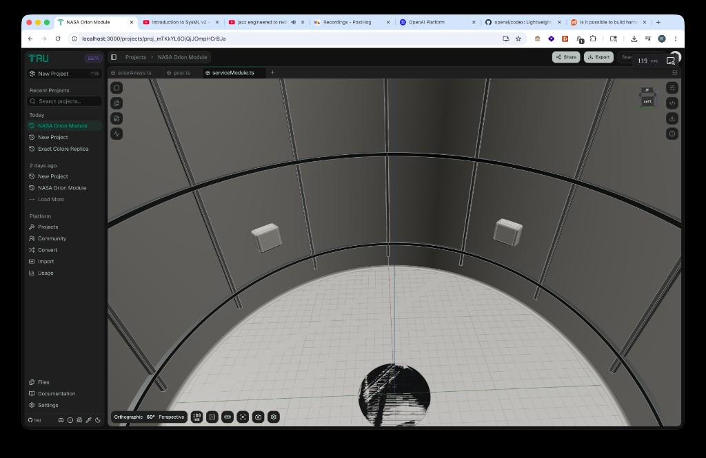

# Z-Fighting on Coincident CAD Faces: Prevention Techniques and Recommendations

Investigation into the speckled "fighting" artifact seen when two CAD surfaces occupy the same plane in the Tau viewer (`apps/ui/app/components/geometry/graphics/three/react/gltf-mesh.tsx`), an assessment of the proposed color-derived depth-offset fix, a survey of how modern CAD software handles coincident faces, and prioritized recommendations.

## Executive Summary

The noisy black/white speckle in the reference image is **z-fighting**: two surfaces sit at (nearly) identical depth, so the rasterizer arbitrarily — and per-frame inconsistently — picks a winner per pixel. The proposed remedy ("compute a z-index from the mesh color") is half-right: a _stable per-object depth offset_ does eliminate the flicker, but **color is the wrong key**. Color carries no spatial ordering, collides (different colors → same offset), and fails the most common case (two coincident faces of the _same_ color get the _same_ bias and keep fighting). The principled render-time fix is a deterministic, monotonic depth bias keyed on **stable draw-order identity** via `polygonOffset` (which three.js maps to WebGPU `depthBias`/`depthBiasSlopeScale`). Crucially, _no_ render-time technique can make the "correct" face appear, because for truly coincident faces correctness is undefined — every modern CAD package treats coincident faces as a **modeling defect**, not a rendering one, and resolves them at the geometry level (boolean union, imprint/merge, or a sub-tolerance offset). Recommendation: ship a stable `polygonOffset` tie-breaker to kill the flicker (R1), keep leaning on reversed-Z precision (R2), and surface coincidence as a model-quality signal rather than papering over it forever (R4).

## Table of Contents

- Problem Statement
- Background: What Causes Z-Fighting
- Current Tau Rendering Pipeline
- Assessment of the Color-Derived Z-Index Proposal
- How Modern CAD Software Handles Coincident Faces
- Technique Catalog
- Recommendations
- Trade-offs
- Code Examples
- References

## Problem Statement

When a project contains two surfaces that lie on the same plane (e.g. a part resting exactly on a floor, two bodies sharing a wall, or a duplicated solid), the viewer renders a shimmering, noisy mixture of both surfaces instead of a clean single face:



In the screenshot the bottom hemisphere disc and the dark band show the classic z-fighting signature: a per-pixel, noise-like interleaving of two surfaces, which flickers as the camera orbits. The question driving this investigation:

> Can we _entirely prevent_ z-fighting by assigning each mesh a deterministic depth offset (a "z-index") derived from its color, and how do modern CAD packages deal with incident faces like this?

### Scope and Non-Goals

**In scope**: render-time and geometry-time techniques to eliminate or stabilize z-fighting between opaque CAD surfaces in the Tau viewer; assessment of the color-keyed offset idea.

**Out of scope**: transparent-surface ordering (separate sort concern, see `reversed-depth-transparent-sort.ts`); edge/line bias (already solved in `gltf-edges.ts`); MSAA/AA quality.

## Background: What Causes Z-Fighting

Z-fighting (a.k.a. "stitching"/"planefighting") occurs when two primitives map to **near-identical depth-buffer values**. The depth buffer has finite precision, so when the rounded depth of surface A equals that of surface B, the depth test (`a < b`) becomes a coin flip resolved by sub-pixel rasterization order and floating-point round-off. The winner varies per pixel and per frame, producing the noisy shimmer. (Wikipedia; NVIDIA "Visualizing Depth Precision".)

There are **two distinct failure modes**, and they demand different fixes:

| Mode                 | Cause                                                                                                                                | Can precision/offset fix it?                                                                                           |
| -------------------- | ------------------------------------------------------------------------------------------------------------------------------------ | ---------------------------------------------------------------------------------------------------------------------- |
| **Near-coincident**  | Faces are _close_ but not equal; depth-buffer precision is too coarse to separate them (worsens with distance, wide near/far range). | Yes — a higher-precision depth buffer (reversed-Z) or a depth offset separates them.                                   |
| **Truly coincident** | Faces occupy the _exact same plane_; depth difference is genuinely zero.                                                             | **No** amount of precision helps (0 difference stays 0). Only a deterministic offset or a geometry change resolves it. |

The reference image is the **truly coincident** mode — the model was authored with two faces sharing a plane. This distinction is the crux of every recommendation below.

## Current Tau Rendering Pipeline

What Tau already does (so we know what to build on, not reinvent):

| Concern                 | Current state                                                                                                                                                     | File                                    |
| ----------------------- | ----------------------------------------------------------------------------------------------------------------------------------------------------------------- | --------------------------------------- |
| **Surface meshes**      | One glTF node → one primitive → one `Mesh` per replicad geometry; `MeshStandard`/`MeshMatcap`, `DoubleSide`, `depthWrite` default (true). **No `polygonOffset`.** | `replicad-to-gltf.ts`, `gltf-matcap.ts` |
| **Edges**               | Already carry a coplanar **depth bias** so lines win against their own faces (WebGL log-depth vertex bias; WebGPU `depthBias`).                                   | `gltf-edges.ts`                         |
| **WebGL depth buffer**  | `logarithmicDepthBuffer: true` (viewport).                                                                                                                        | `renderer.ts`                           |
| **WebGPU depth buffer** | `reversedDepthBuffer: true` (viewport) — the high-precision float-Z layout.                                                                                       | `renderer.ts`                           |
| **Camera near/far**     | Adaptive, framed to geometry radius (not a fixed `0.1 … 100000`).                                                                                                 | `useCameraFraming` in `stage.tsx`       |

Two takeaways:

1. Tau already invests in **depth precision** (log-depth on WebGL, reversed-Z on WebGPU, adaptive near/far). So the _near-coincident_ mode is largely mitigated already — meaning the artifacts users still see are dominated by the _truly coincident_ mode, which precision cannot fix.
2. Tau already solved the analogous edge-vs-face fight with a **depth bias** — the surface-vs-surface fight is the same class of problem, missing the same tool (`polygonOffset`).

## Assessment of the Color-Derived Z-Index Proposal

The idea: hash each mesh's color into a small depth offset so the same color always wins the depth test consistently, removing the flicker.

**What it gets right**: stability comes from _determinism_. If the depth tie is broken by a value that is constant across frames and camera angles, the flicker stops. A per-object offset is exactly the right shape.

**Why color is the wrong key**:

| Problem                                       | Consequence                                                                                                                                                                                          |
| --------------------------------------------- | ---------------------------------------------------------------------------------------------------------------------------------------------------------------------------------------------------- |
| **No collisions guarantee**                   | Two different colors can hash to the same offset bucket → they still fight. A color→depth map is not injective.                                                                                      |
| **Same-color coincidence is the common case** | A duplicated body, or a part and its mirror, frequently share a color. Identical color → identical offset → **zero separation → still fights.** This is precisely the case in the screenshot family. |
| **Color is not an ordering**                  | "Red in front of blue" is arbitrary and semantically meaningless. The winner is stable but not _correct_ — and which face _should_ win is itself undefined for coincident faces.                     |
| **Color can change**                          | Theme tint, matcap, opacity edits, and per-group recolor all mutate color. A depth ordering that shifts when the user recolors a part is a latent surprise-bug class.                                |
| **Vertex colors break the premise**           | Tau meshes may use `COLOR_0` vertex colors (`gltf-matcap.ts`), so a single mesh has no one color to hash.                                                                                            |

**Verdict**: keep the _deterministic per-object offset_ insight; **discard color as the key**. The correct key is a **stable, unique, monotonic per-mesh identity** — e.g. the glTF node draw order (`Shape_0`, `Shape_1`, …), which is already stable across renders and guaranteed unique. Map that index to an increasing `polygonOffsetFactor`/`polygonOffsetUnits` so each coincident layer gets a distinct, repeatable depth nudge. This is the standard "stacked decals" pattern (each layer gets a larger offset).

This still only makes the winner **deterministic**, not **correct**: it converts ugly flicker into a clean (if arbitrary) layering. For coincident faces that is the best a renderer can do — see the next section for why.

## How Modern CAD Software Handles Coincident Faces

The consistent message across SolidWorks, Fusion 360, Inventor, Onshape, FreeCAD, and the OCCT kernel: **coincident faces are a geometry/modeling problem, not a rendering problem.** Real-time rasterization has no universal fix because the ambiguity is inherent.

1. **Treat it as a modeling defect.** Fusion 360's own guidance: where two bodies share an OD/ID exactly, "this is classic z-fighting… and is probably not realistic modeling technique, as you could not manufacture that model." The recommended fix is to make one face slightly larger/smaller, delete the redundant face, or offset by a manufacturable amount (e.g. 0.1 mm). (Autodesk forums.)
2. **Resolve at the kernel via booleans + interference handling.** OCCT's Boolean Operations detect "interferences" (intersection, _overlapping_, and _touching_) and split interfered regions so every overlap gets a topological boundary; coincident faces lying on the same surface are then merged into a single "maximal face" to avoid runaway fragmentation. (OCCT Booleans paper, quaoar.su.) When arguments are near-coincident, BOP often _fails_ without a **fuzzy tolerance** — FreeCAD's fix for coincident-face arrays is to apply an auto-fuzzy tolerance that scales with model size. The lesson: kernels resolve coincidence by _changing the topology_, not by tricking the depth buffer.
3. **Display-mode mitigations are explicitly imperfect.** Inventor exposes "Refine Appearance" / "Disable Automatic Refinement" and depth-dimming toggles, but the vendors are candid that these only help when zoomed in and there is "no bulletproof solution" at the display layer. (Autodesk Inventor forum.)
4. **Faceting alignment.** When two cylinders/spheres are tessellated with different facet counts or phases, their triangles interleave. CAD users ask for "manually set facet count from the same starting point" — i.e. align tessellation — which is a _meshing_ fix, not a depth-buffer fix.

So the authoritative CAD answer to "how do they deal with incident faces" is: **they don't let them coincide.** Where they must render them anyway, they fall back to the same render-time depth-bias / display-quality knobs available to us, with the same caveats.

## Technique Catalog

Every available lever, with applicability to Tau's _opaque coincident surface_ case:

| #   | Technique                              | Mechanism                                                                                                                                   | Fixes true coincidence?        | Cost / caveat                                                              | Fit for Tau                                          |
| --- | -------------------------------------- | ------------------------------------------------------------------------------------------------------------------------------------------- | ------------------------------ | -------------------------------------------------------------------------- | ---------------------------------------------------- |
| T1  | **`polygonOffset` (stable, per-node)** | Biases triangle depth in the rasterizer; three.js maps `polygonOffsetUnits→depthBias`, `polygonOffsetFactor→depthBiasSlopeScale` on WebGPU. | **Yes** (deterministic winner) | Triangles only (not lines/points); needs a stable key.                     | **Primary fix.**                                     |
| T2  | **Reversed-Z float depth**             | Cancels the `1/z` precision crunch; near-magic precision.                                                                                   | No (0 stays 0)                 | Best general precision. Already on WebGPU viewport.                        | Keep; extend to WebGL when three.js ships it.        |
| T3  | **Logarithmic depth buffer**           | Per-fragment `gl_FragDepth` rewrite for uniform precision.                                                                                  | No                             | Disables early-Z → overdraw perf hit on dense scenes.                      | Already on; reversed-Z is the better long-term path. |
| T4  | **Tighten near/far**                   | Less range to quantize.                                                                                                                     | Near-coincident only           | Already adaptive via `useCameraFraming`.                                   | Already done.                                        |
| T5  | **Depth-write off + `renderOrder`**    | Skip depth writes, force paint order.                                                                                                       | Yes (for intentional overlays) | Loses correct occlusion vs _other_ geometry; meant for 2D overlays/decals. | Wrong tool for solid surfaces.                       |
| T6  | **Stencil decaling**                   | Mask the coincident region, draw the "top" face with depth test off inside the mask.                                                        | Yes                            | Multi-pass; complex; per-pair authoring.                                   | Overkill for general surfaces.                       |
| T7  | **Geometry offset (nudge a face)**     | Physically separate by a sub-visible amount.                                                                                                | Yes (removes the tie)          | Changes the model; manufacturability concern; kernel-side.                 | Authoring guidance / optional kernel pass.           |
| T8  | **Boolean union / imprint-merge**      | Remove the duplicate surface entirely.                                                                                                      | Yes (root cause)               | Changes topology; user intent.                                             | The "correct" CAD fix; can't be forced silently.     |
| T9  | **Tessellation alignment**             | Same facet count/phase so triangles don't interleave.                                                                                       | Helps curved coincidence       | Kernel meshing change.                                                     | Niche; document.                                     |

Note T1's hard limit (confirmed in the WebGPU spec, gpuweb#4729): **depth bias applies to triangles only, never lines/points.** That is exactly why Tau's edge bias in `gltf-edges.ts` is implemented in the _shader_ (vertex `vFragDepth` on WebGL, `depthNode` on WebGPU) rather than via `polygonOffset` — surfaces, being triangles, can use the cheaper `polygonOffset` path directly.

## Recommendations

| #   | Action                                                                                                                                                                       | Priority | Effort | Impact                                                       |
| --- | ---------------------------------------------------------------------------------------------------------------------------------------------------------------------------- | -------- | ------ | ------------------------------------------------------------ |
| R1  | Add a **stable, monotonic `polygonOffset`** to surface materials keyed on glTF node draw order (NOT color), applied in `gltf-mesh.tsx`/material setup.                       | P0       | Low    | High — kills the flicker deterministically on both backends. |
| R2  | Keep **reversed-Z** (WebGPU) and migrate WebGL to reversed-Z when three.js supports it, retiring log-depth's early-Z penalty.                                                | P1       | Med    | Med — best general precision; helps near-coincident.         |
| R3  | Verify **adaptive near/far** stays tight for tall/zoomed scenes; expose a floor so framing never blows the range open.                                                       | P2       | Low    | Low–Med.                                                     |
| R4  | Surface coincidence as a **model-quality signal** (lint/warning or a geometry-test analyser) rather than only hiding it — aligns with how CAD packages treat it as a defect. | P2       | Med    | Med — addresses root cause; educates users.                  |
| R5  | Document the authoring guidance ("don't model exactly coincident faces; offset or union") in the editor docs.                                                                | P3       | Low    | Low.                                                         |

### R1 design notes (the concrete fix)

- **Key**: derive the offset from the node's stable index/identity (`Shape_<i>` ordering from `replicad-to-gltf.ts`), or a stable per-mesh counter assigned during scene traversal. This is unique and repeatable; color is neither.
- **Magnitude**: small negative factor/units (e.g. `factor = -1 * layerIndex`, `units = -1 * layerIndex`) so each successive coincident layer is nudged consistently toward the camera. Tune against the adaptive near/far so the nudge is invisible at normal zoom (the same "1 mm is invisible" principle CAD uses).
- **Backends**: set `material.polygonOffset = true` plus `polygonOffsetFactor`/`polygonOffsetUnits`; three.js translates these to WebGPU `depthBias`/`depthBiasSlopeScale` automatically. One code path covers both renderers.
- **Honesty about limits**: R1 produces a _stable arbitrary_ layering, not a _correct_ one. That is the ceiling for coincident faces and matches CAD display behavior. Correctness requires R4/geometry change.

## Trade-offs

| Approach                                   | Eliminates flicker                      | "Correct" result      | Changes the model | Perf                  |
| ------------------------------------------ | --------------------------------------- | --------------------- | ----------------- | --------------------- |
| Color-keyed offset (proposed)              | Partially (fails same-color/collisions) | No                    | No                | Free                  |
| **Stable node-index `polygonOffset` (R1)** | **Yes**                                 | No (stable-arbitrary) | No                | Free (triangles)      |
| Reversed-Z precision (R2)                  | Near-coincident only                    | Yes when separable    | No                | Better than log-depth |
| Geometry offset / boolean (R4/T7/T8)       | Yes                                     | **Yes**               | **Yes**           | Kernel cost           |

## Code Examples

The proposed color-keyed approach (rejected) versus the stable-identity approach (recommended), conceptually:

```typescript
// ❌ Rejected: color as the depth key.
// Collides across colors; identical for same-colored coincident bodies (no separation).
const offset = hashColorToOffset(mesh.material.color); // not injective, not an ordering
mesh.material.polygonOffsetFactor = offset;

// ✅ Recommended: stable, unique, monotonic per-node identity as the key.
// `layerIndex` is the glTF node draw order (Shape_0, Shape_1, ...): stable + unique.
mesh.material.polygonOffset = true;
mesh.material.polygonOffsetFactor = -1 * layerIndex;
mesh.material.polygonOffsetUnits = -1 * layerIndex;
// three.js maps these to WebGPU depthBias / depthBiasSlopeScale automatically.
```

This mirrors the existing edge-vs-face bias already shipping in `gltf-edges.ts` (`sharedDepthBiasUniform`), generalized from "edges beat their faces" to "each coincident surface layer gets a deterministic depth slot."

## References

- [Z-fighting — Wikipedia](https://en.wikipedia.org/wiki/Z-fighting)
- [Visualizing Depth Precision — NVIDIA](https://developer.nvidia.com/blog/visualizing-depth-precision/)
- [Reverse Z (and why it's so awesome)](https://tomhultonharrop.com/posts/reverse-z/)
- [OCCT Boolean Operations (interference & maximal-face simplification)](https://quaoar.su/files/papers/cascade/2025-03-Booleans.pdf)
- [How to Avoid Near Coincidence and Sliver Faces in Fusion 360 — Autodesk](https://www.autodesk.com/products/fusion-360/blog/fusion-360-3d-modeling-near-coincidence-silver-faces/)
- [FreeCAD #26119 — Booleans fail on coincident faces; auto-fuzzy tolerance fix](https://github.com/FreeCAD/FreeCAD/issues/26119)
- [WebGPU depthBias does not affect lines/points — gpuweb#4729](https://github.com/gpuweb/gpuweb/issues/4729)
- [three.js: polygonOffset → WebGPU depthBias/depthBiasSlopeScale mapping (forum)](https://discourse.threejs.org/t/webgpu-render-line-color-not-depth-enough-when-a-surface-behind-it/85410)
- Policy: `docs/policy/graphics-backend-policy.md`
- Related: `docs/research/webgpu-fat-line-renderer-aware-depth.md`, `docs/research/gltf-edges-fat-line-performance.md`
