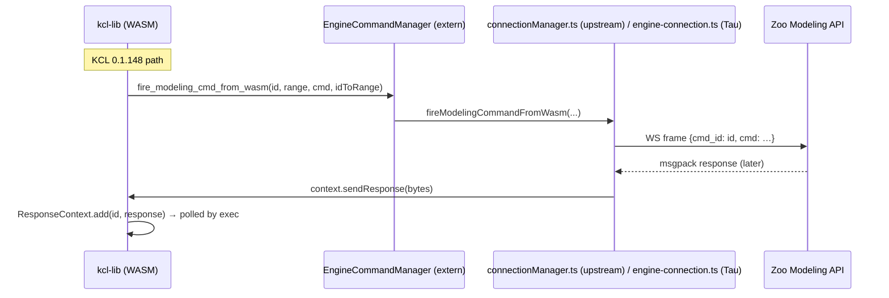
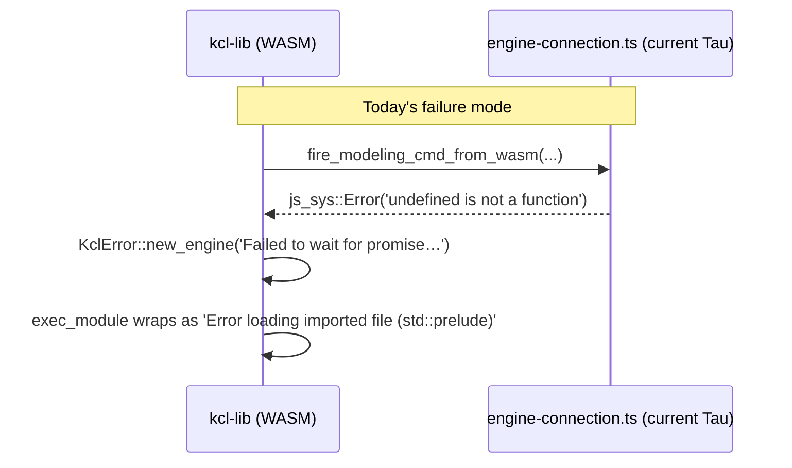

# Zoo KCL 0.1.148 Integration Audit

Investigates the new "Error loading imported file (std::prelude)" failure surfaced after rebuilding `@taucad/kcl-wasm-lib` to 0.1.148, traces it to a material WASM API surface change in KittyCAD/modeling-app, and inventories the rest of the Tau Zoo kernel for latent drift against the upstream contract.

## Executive Summary

The KCL 0.1.148 WASM API split engine I/O into **`EngineCommandManager`** + **`ResponseContext`**, removed **`startFromWasm`**, added **`fireModelingCommandFromWasm`**, reshaped **`sendModelingCommandFromWasm`** to `(id, rangeStr, commandStr, idToRangeStr)`, and changed `Context.execute()` to return a **`SceneGraphDelta`** (snake_case `exec_outcome`) instead of a bare `ExecOutcome`. Tau previously implemented the pre-0.1.131 `EngineConnection` contract, which caused `std::prelude` load failures and websocket bridge errors.

**Update:** Tau now decomposes the stack into **`ZooWebSocketTransport`** (lifecycle + msgpack), **`ZooEngineBridge`** (pending keyed by KCL `id`, full `WebSocketRequest` envelope from `commandStr`), and **`ZooEngineSession`** (`Context.sendResponse(raw bytes)`). `kcl-utils` unwraps `SceneGraphDelta` into the existing execution normalizer; `FileSystemManager.getAllFiles` returns `JSON.stringify(files)` to satisfy the Rust `as_string` + `serde_json::from_str` path. See **§ Resolution in Tau** below.

## Table of Contents

- [Problem Statement](#problem-statement)
- [Methodology](#methodology)
- [Findings](#findings)
- [Recommendations](#recommendations)
- [Trade-offs](#trade-offs)
- [Code Examples](#code-examples)
- [Diagrams](#diagrams)
- [References](#references)

## Problem Statement

After bumping `@taucad/kcl-wasm-lib` from 0.1.130 to 0.1.148, opening any KCL project in Tau (e.g. the `KittyCAD/modeling-app` sample loaded against `main.kcl`) renders the file error pane with:

```text
Error loading imported file (std::prelude). Open it to view more details.
Error loading imported file (std::types). Open it to view more details.
Failed to wait for promise from send modeling command:
JsValue(Error: engine: engine: Error: engine: engine:
  at e.simple (http://localhost:3000/assets/engine-connection-BVPU7lLD.js:3:176)
  at C.sendModelingCommandFromWasm (http://localhost:3000/assets/engine-connection-BVPU7lLD.js:3:3727))
```

The error did not appear in 0.1.130 builds. Mock-mode parameter extraction (`pnpm nx test runtime ./src/kernels/zoo/zoo.kernel.test.ts`) still passes 20/20 tests after the bump, so the regression is scoped to the engine-connected execution path. The double `engine: engine:` prefix indicates a JS rejection was wrapped as a `KclError::new_engine` and then re-wrapped during JsFuture awaiting.

## Methodology

1. Read upstream wasm-bindgen extern declarations:
   - `repos/zoo-modeling-app/rust/kcl-wasm-lib/src/context.rs` (Context constructor + execute API)
   - `repos/zoo-modeling-app/rust/kcl-lib/src/engine/conn_wasm.rs` (`EngineCommandManager` + `ResponseContext`)
   - `repos/zoo-modeling-app/rust/kcl-lib/src/fs/wasm.rs` (`FileSystemManager` contract)
   - `repos/zoo-modeling-app/rust/kcl-lib/src/modules.rs` (`read_std()` baked-in std modules)
   - `repos/zoo-modeling-app/rust/kcl-lib/src/execution/exec_ast.rs` (origin of "Error loading imported file" message)
2. Compared the upstream JS-side reference implementation in `repos/zoo-modeling-app/src/network/connectionManager.ts` and `repos/zoo-modeling-app/src/lang/std/fileSystemManager.ts` to Tau's `packages/runtime/src/kernels/zoo/engine-connection.ts` and `filesystem-manager.ts`.
3. Surveyed commit history: `git log --oneline --since='2025-08-01' -- rust/kcl-wasm-lib/ rust/kcl-lib/src/engine/ rust/kcl-lib/src/fs/ rust/kcl-lib/src/modules.rs` and inspected the high-impact refactors (e.g. `d5fb69e57 Instantiate RustContext and EngineCommandManager off KclManager`, `ed0516e95 Change to return exec outputs with errors`, `ad66c831f Rename CompilationError to CompilationIssue`).
4. Verified mock vs engine-connected divergence by re-running `pnpm nx test runtime ./src/kernels/zoo/zoo.kernel.test.ts --watch=false` (passes — mock path).

## Findings

### Finding 1: WASM `Context` constructor expects a separate `EngineCommandManager`, Tau passes the `EngineConnection` directly

Upstream `Context::new` (after 0.1.131) is:

```rust
#[wasm_bindgen(constructor)]
pub fn new(
    engine_manager: kcl_lib::wasm_engine::EngineCommandManager,
    fs_manager: kcl_lib::wasm_engine::FileSystemManager,
) -> Result<Self, JsValue>
```

with `EngineCommandManager` defined in `rust/kcl-lib/src/engine/conn_wasm.rs`:

```rust
#[wasm_bindgen(module = "/../../src/network/connectionManager.ts")]
extern "C" {
    pub type EngineCommandManager;

    #[wasm_bindgen(constructor)] pub fn new() -> EngineCommandManager;

    #[wasm_bindgen(method, js_name = fireModelingCommandFromWasm, catch)]
    fn fire_modeling_cmd_from_wasm(this: &EngineCommandManager, id: String, rangeStr: String, cmdStr: String, idToRangeStr: String) -> Result<(), js_sys::Error>;

    #[wasm_bindgen(method, js_name = sendModelingCommandFromWasm, catch)]
    fn send_modeling_cmd_from_wasm(this: &EngineCommandManager, id: String, rangeStr: String, cmdStr: String, idToRangeStr: String) -> Result<js_sys::Promise, js_sys::Error>;

    #[wasm_bindgen(method, js_name = startNewSession, catch)]
    fn start_new_session(this: &EngineCommandManager) -> Result<js_sys::Promise, js_sys::Error>;
}
```

Tau still wires `this` (the `EngineConnection` instance) as the first `Context` argument:

```ts
this.context = await new this.wasmModule.Context(this, this.fileSystemManager);
```

`wasm-bindgen` extern types use duck typing, so the constructor itself succeeds. The breakage emerges only when KCL invokes a method that no longer matches Tau's surface (Findings 2–4). The `startFromWasm` extern was removed in commit `d5fb69e57` (Feb 2026), so Tau's `startFromWasm()` method is dead weight.

### Finding 2: `sendModelingCommandFromWasm` argument order is reshaped end-to-end

| Position | KCL ≤ 0.1.130 (Tau today)      | KCL 0.1.148                                     |
| -------- | ------------------------------ | ----------------------------------------------- |
| `arg[0]` | `commandString` (legacy)       | `id` (UUID)                                     |
| `arg[1]` | `id` (legacy)                  | `rangeStr` (JSON `SourceRange`)                 |
| `arg[2]` | `cmd` (raw `WebSocketRequest`) | `commandStr` (raw `EngineCommand` body)         |
| `arg[3]` | `pathString` (legacy)          | `idToRangeStr` (JSON `{ [uuid]: SourceRange }`) |

Upstream JS impl (`src/network/connectionManager.ts` line 1313–1366):

```ts
async sendModelingCommandFromWasm(id, rangeStr, commandStr, idToRangeStr) {
  const range: SourceRange = JSON.parse(rangeStr);
  const command: EngineCommand = JSON.parse(commandStr);
  const idToRangeMap = JSON.parse(idToRangeStr);
  const resp = await this.sendCommand(id, { command, range, idToRangeMap });
  return msgpackEncode(resp[0]);
}
```

Tau's signature (`packages/runtime/src/kernels/zoo/engine-connection.ts:189`):

```ts
public async sendModelingCommandFromWasm(_commandString, _id, cmd, _pathString) {
  const modelingCommand = JSON.parse(cmd) as WebSocketRequest;
  const response = await this.sendCommand(modelingCommand);
  return msgpackEncode(response);
}
```

Two consequences:

- The string Tau parses as `WebSocketRequest` is actually only the inner `EngineCommand` — `cmd_id`/`batch_id`/`request_id` are missing, so `this.sendCommand` cannot key the pending-command map and the request goes out without a `request_id` for the engine to echo back.
- The real `id` and `rangeStr` (positions 0 and 1) are silently dropped. The engine receives a malformed envelope, replies with an error (or the Tau-side promise times out); in either case the JsFuture rejects and `do_send_modeling_cmd` reports `Failed to wait for promise from send modeling command: …` — exactly the screenshot text.

### Finding 3: `fireModelingCommandFromWasm` is missing entirely

KCL 0.1.148 routes most prelude / scene-setup commands through `inner_fire_modeling_cmd → manager.fire_modeling_cmd_from_wasm`, which calls JS `fireModelingCommandFromWasm`. Tau exposes no such method; wasm-bindgen's `catch` binding produces `js_sys::Error` (`undefined is not a function`), the call site converts that to `KclError::new_engine`, and module loading explodes before any engine round-trip happens. This is the most likely _first_ failure during `std::prelude` evaluation because default plane / scene initialization runs as fire-and-forget.

### Finding 4: `Context.sendResponse(bytes)` is unused — KCL never sees engine responses for fire-and-forget commands

`Context` exposes a new method:

```rust
#[wasm_bindgen(js_name = sendResponse)]
pub async fn send_response(&self, data: js_sys::Uint8Array) {
    self.response_context.send_response(data).await
}
```

Upstream's WebSocket message handler decodes the binary frame and forwards it via `rustContext.sendResponse(bytes)` so KCL can drain pending fire-and-forget commands from `ResponseContext.responses`. Tau's `onWebSocketMessage` handler decodes inline and resolves promises in its own `pendingCommands` map; nothing is forwarded to `context.sendResponse`. After Recommendation R1/R2 land, this becomes mandatory — without it, every `fire_modeling_cmd_from_wasm` followed by a downstream KCL operation that polls `responses` will hang.

### Finding 5: `Context.execute()` now returns `SceneGraphDelta`, not `ExecOutcome`

`rust/kcl-wasm-lib/src/context.rs:113`:

```rust
async fn execute_typed(&self, …) -> Result<SceneGraphDelta, KclErrorWithOutputs> {
    …
    guard.engine_execute(&ctx, program).await
}
```

Tau's `executeProgram` (`kcl-utils.ts:422-470`) still casts the result through `normalizeKclExecutionResult` expecting `ExecOutcome` shape (`variables`, `operations`, `artifactGraph`, `issues`/`errors`). `SceneGraphDelta` wraps `exec_outcome` _plus_ a frontend-state diff (used by ZMA's React frontend to update its scene graph). Today nothing crashes only because the engine path never reaches a successful return; the moment Findings 1–4 are fixed, this will surface as missing fields.

### Finding 6: `Context` gained a `ProjectManager` API that Tau bypasses

`rust/kcl-wasm-lib/src/api.rs` exposes `open_project`, `add_file`, `update_file`, `switch_file`, `remove_file`, `refresh`, `hack_set_program`, `sketch_execute_mock`, `new_sketch`, etc. KCL now tracks files itself via `ProjectManager` so it can manage source-deltas and undo checkpoints. Tau still relies entirely on the host filesystem via `FileSystemManager`, which keeps working for module resolution but means we cannot drive sketch-block editing, undo, or partial sketch re-execution. Not a current bug, but a wide latent gap relative to the new feature surface.

### Finding 7: `getAllFiles` JS-side return type is mismatched

Rust binding (unchanged):

```rust
async fn get_all_files(&self, …) -> Result<Vec<TypedPath>, KclError> {
    …
    let s = value.as_string()…?;
    let files: Vec<String> = serde_json::from_str(&s)?;
}
```

Upstream JS returns `string[]` directly (`src/lang/std/fileSystemManager.ts:99`) — `value.as_string()` on a JS array does not yield a parseable JSON string. **Tau now returns `JSON.stringify(files)` from `getAllFiles`** so the Rust binding’s `serde_json::from_str` path succeeds for this host. Upstream modeling-app may still want to align the JS side for consistency; Tau’s behavior is documented in `filesystem-manager.ts`.

### Finding 8: `CompilationError → CompilationIssue` and `ExecOutcome.errors → ExecOutcome.issues` already addressed

Confirmed already remediated:

- `kcl-utils.ts` imports `CompilationIssue as CompilationError` from the renamed binding.
- `normalizeKclExecutionResult` reads `record['issues']` with `record['errors']` as a legacy fallback.

### Finding 9: `web-time` worker-side panic patched via `worker-preload-polyfill`

`packages/runtime/src/framework/worker-preload-polyfill.ts` exposes `window.performance` to KCL's `web-time` crate. Already fixed when migrating to 0.1.148; documented for completeness.

### Finding 10: Sketch-block warning is the new opt-in language feature, not the cause

The screenshot text "Use of sketch blocks is experimental and may change or be removed." is emitted by `rust/kcl-lib/src/std/prelude.kcl` (sketch-related stdlib added in commits `cff54a492`, `5d11754b5`, `2d1ef599a`, etc.). It is informational; the 10 errors below it are downstream symptoms of Findings 1–5, not of sketch-block usage.

## Recommendations

| #   | Action                                                                                                                                                                                                                                          | Priority | Effort | Impact                                             |
| --- | ----------------------------------------------------------------------------------------------------------------------------------------------------------------------------------------------------------------------------------------------- | -------- | ------ | -------------------------------------------------- |
| R1  | Rewrite `sendModelingCommandFromWasm` to the `(id, rangeStr, commandStr, idToRangeStr)` signature; build the WS envelope as `{ command, range, idToRangeMap }` keyed by `id`.                                                                   | P0       | Med    | Unblocks all engine execution                      |
| R2  | Add `fireModelingCommandFromWasm(id, rangeStr, commandStr, idToRangeStr)` that calls `sendCommand` without awaiting (mirror upstream `connectionManager.ts:1272`).                                                                              | P0       | Low    | Unblocks std::prelude scene init                   |
| R3  | In `onWebSocketMessage`, decode the raw msgpack bytes and call `this.context.sendResponse(new Uint8Array(rawBuffer))` _before_ resolving Tau's own `pendingCommands` map.                                                                       | P0       | Low    | Required to drain fire-and-forget responses        |
| R4  | Drop `startFromWasm`; keep `startNewSession` as an async no-op (or wire to a real "reset session" path once Tau supports multi-execution).                                                                                                      | P1       | Low    | Removes dead code, matches upstream extern surface |
| R5  | Update `kcl-utils.ts::executeProgram` to consume the new `SceneGraphDelta` envelope: pull `exec_outcome` out and run the existing `normalizeKclExecutionResult`; surface the frontend-state diff as a discriminated union once consumers exist. | P0       | Med    | Required after R1–R3 to read execute results       |
| R6  | Replace the `id` generator: use the `id` argument (UUID) provided by KCL for `pendingCommands` keying; remove `generateRequestId` for the WASM-driven path.                                                                                     | P0       | Low    | Necessary for R1; keeps echo-matching reliable     |
| R7  | Add an integration test that connects to a stub WASM `Context` (or a fake engine) and asserts the four-arg contract for both fire and send paths so future upstream churn breaks loudly.                                                        | P1       | Med    | Prevents the next silent contract drift            |
| R8  | File an upstream issue about the `getAllFiles` JSON contract mismatch (string vs string[]); align Tau when upstream picks a side.                                                                                                               | P2       | Low    | Removes the shared latent bug                      |
| R9  | Defer `ProjectManager` adoption until Tau wants sketch-block editing / undo. Document the gap in `docs/research/kcl-feature-surface-gaps.md` so it's tracked.                                                                                   | P2       | Low    | Avoids over-scoping this fix                       |
| R10 | Update `.agent/skills/rebuild-kcl-wasm-lib/SKILL.md` "Common upstream breaks" matrix to call out the engine-side WASM ABI; future bumps will then re-audit by default.                                                                          | P1       | Low    | Knowledge capture                                  |

## Trade-offs

| Approach                                                                | Pros                                                                                       | Cons                                                                                                |
| ----------------------------------------------------------------------- | ------------------------------------------------------------------------------------------ | --------------------------------------------------------------------------------------------------- |
| **A. Mirror upstream `connectionManager.ts` 1:1** (R1–R6)               | Direct parity with KCL contract; we get bug fixes for free on rebase; no behavioural drift | Tau's existing `pendingCommands` + reconnect logic must be reconciled with the new `id`-driven flow |
| **B. Adapter shim**: keep Tau's old API and translate inside one method | Smaller surface diff today                                                                 | Locks in a translation layer that breaks every upstream rename; higher long-term maintenance        |
| **C. Pin KCL at 0.1.130 indefinitely**                                  | Zero work                                                                                  | Loses sketch-block fixes (the original repro), bleeds further every release; not a strategy         |

Recommended: **A**. Tau's `EngineConnection` is small enough that aligning to upstream is cheaper than maintaining an adapter, and the rebuild-kcl-wasm-lib skill already commits us to periodic upstream syncs.

## Code Examples

### Replacement `sendModelingCommandFromWasm`

```ts
public async sendModelingCommandFromWasm(
  id: string,
  rangeStr: string,
  commandStr: string,
  idToRangeStr: string,
): Promise<Uint8Array<ArrayBuffer>> {
  if (!this.isConnected) {
    await this.cleanup();
    await this.initialize();
  }

  const command = JSON.parse(commandStr) as Models['EngineCommand_type'];
  const range = JSON.parse(rangeStr) as Models['SourceRange_type'];
  const idToRangeMap = JSON.parse(idToRangeStr) as Record<string, Models['SourceRange_type']>;

  const wsRequest: Models['WebSocketRequest_type'] = {
    type: 'modeling_cmd_req',
    cmd_id: id,
    cmd: command,
  };

  const response = await this.sendCommandKeyed(id, wsRequest, { range, idToRangeMap });
  return msgpackEncode(response);
}
```

### New `fireModelingCommandFromWasm`

```ts
public fireModelingCommandFromWasm(
  id: string,
  rangeStr: string,
  commandStr: string,
  idToRangeStr: string,
): void {
  // Fire and forget: the engine's response is delivered via Context.sendResponse
  // out of band, not on this call's promise.
  void this.sendModelingCommandFromWasm(id, rangeStr, commandStr, idToRangeStr).catch((error) => {
    log.warn('fire-and-forget modeling command rejected', { id, error });
  });
}
```

### Forwarding WS responses to KCL

```ts
private readonly onWebSocketMessage = (event: MessageEvent): void => {
  if (event.data instanceof ArrayBuffer && this.context) {
    void this.context.sendResponse(new Uint8Array(event.data));
  }
  this.handleMessage(event); // existing path: still resolve Tau's own pendingCommands
};
```

## Diagrams

### Old vs new wire path during `std::prelude` evaluation





## Resolution in Tau

| Finding / recommendation                                                                           | Status                                                                                                                                                                                                   |
| -------------------------------------------------------------------------------------------------- | -------------------------------------------------------------------------------------------------------------------------------------------------------------------------------------------------------- |
| Engine bridge: four-arg `fire` / `send`, envelope keyed by KCL `id`, raw `sendResponse` forwarding | Implemented via `ZooEngineBridge`, `ZooEngineSession`, and `ZooWebSocketTransport` (`packages/runtime/src/kernels/zoo/`).                                                                                |
| `startFromWasm` removal; `startNewSession` no-op                                                   | `MockEngineConnection` + `ZooEngineBridge` expose async `startNewSession` only.                                                                                                                          |
| `SceneGraphDelta` / `exec_outcome` unwrap                                                          | `normalizeSceneGraphDelta` + `executeProgram` in `kcl-utils.ts`.                                                                                                                                         |
| `getAllFiles` JSON string contract                                                                 | `FileSystemManager.getAllFiles` returns `JSON.stringify(files)` + tests.                                                                                                                                 |
| Regression guard tests                                                                             | `zoo-websocket-transport.test.ts`, `zoo-engine-bridge.test.ts`, `zoo-engine-session.test.ts`, `wasm-context-contract.test.ts`, `engine-connection.integration.test.ts`, `kcl-scene-graph-delta.test.ts`. |
| ProjectManager / sketch API parity                                                                 | Intentionally deferred — tracked in `docs/research/kcl-feature-surface-gaps.md`.                                                                                                                         |

## References

- KCL prelude/types definitions: `repos/zoo-modeling-app/rust/kcl-lib/std/prelude.kcl`, `std/types.kcl`
- Module resolver / `read_std`: `repos/zoo-modeling-app/rust/kcl-lib/src/modules.rs`
- Engine bridge: `repos/zoo-modeling-app/rust/kcl-lib/src/engine/conn_wasm.rs`
- WASM context: `repos/zoo-modeling-app/rust/kcl-wasm-lib/src/context.rs`
- WASM API surface: `repos/zoo-modeling-app/rust/kcl-wasm-lib/src/api.rs`
- Upstream JS reference impl: `repos/zoo-modeling-app/src/network/connectionManager.ts`, `repos/zoo-modeling-app/src/lang/std/fileSystemManager.ts`
- Tau Zoo kernel: `packages/runtime/src/kernels/zoo/{engine-connection,kcl-utils,filesystem-manager,zoo.kernel}.ts`
- Rebuild workflow: `.agent/skills/rebuild-kcl-wasm-lib/SKILL.md`
- Triggering upstream commits:
  - `d5fb69e57` Instantiate `RustContext` and `EngineCommandManager` off `KclManager`, remove circular deps (#10173)
  - `ad66c831f` Rename CompilationError to CompilationIssue (#10638)
  - `ed0516e95` Change to return exec outputs with errors (#10848)
  - `f57060817` Fix to update frontend state on all engine executions (#10814)
  - `cff54a492` / `5d11754b5` Sketch 2.0 KCL sketch block execution
