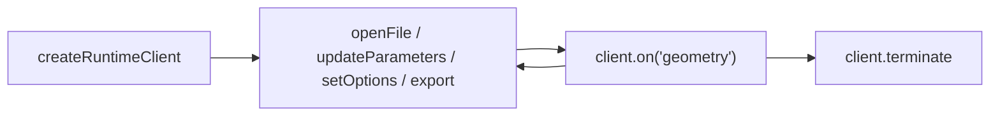

# @taucad/runtime

Multi-kernel CAD runtime that powers [tau.new](https://tau.new). Build a
client, send a command, consume the result.

## Quick start

`client.export(format, { code, file })` self-provisions an in-memory
filesystem, connects on first call, runs the render, and resolves a single
`ExportResult`.

```typescript
import { createRuntimeClient, presets } from '@taucad/runtime';

const client = createRuntimeClient(presets.all());
const result = await client.export('glb', {
  code: {
    'main.ts': `
    import { drawRoundedRectangle } from 'replicad';
    export default () => drawRoundedRectangle(30, 50, 5).sketchOnPlane('XY').extrude(10);
  `,
  },
  file: 'main.ts',
});

if (!result.success) throw new Error(`Export failed: ${result.issues[0]?.message}`);
console.log(`Exported ${result.data.bytes.byteLength} bytes (${result.data.mimeType})`);
client.terminate();
```

## The lifecycle

Every consumer — UI panes, the CLI, RPC handlers, benchmarks, AI agents —
follows the same shape:

1. **Construct** — `createRuntimeClient(options)` produces an inert client.
   No network, no WASM, and the client itself never allocates a
   `SharedArrayBuffer` — SAB lifecycle is owned by the active
   {@link RuntimeTransportClient} (in-process, dedicated worker, or remote).
   The client is in `lifecycleState: 'unconnected'`.
2. **Command** — `client.openFile`, `client.updateParameters`,
   `client.setOptions`, and `client.export` drive the worker. Each
   command-shaped method (apart from `export`) returns a `RenderOutcome`
   so consumers can branch on supersession without try/catch flow control.
   The first command call lazy-connects the transport and (for inline
   `code:` input) auto-provisions an in-memory filesystem.
3. **Consume** — `client.on('geometry' | 'error' | 'progress' | …, handler)`
   subscribes to the single ordered event stream the worker produces.
   Subscriptions auto-dispose on `client.terminate()`.



`client.connect()` advances the lifecycle without arguments; every
host-wiring concern (SAB pools, FS bridges, worker URLs, deferred filesystem
attachment) is owned by the wired {@link TransportPlugin} callable passed at
construction (`{ transport: webWorkerTransport({ ... }) }`). Opaque
filesystems are produced by the public factories
(`fromMemoryFs`, `fromNodeFs`, `fromBrowserFs`, `fromFsLikeOpaque`,
`fromWorkerOpaque`); raw `MessagePort`s are not part of the public surface.
See [Embedding in a Host](../../apps/ui/content/docs/runtime/guides/embedding-in-a-host.mdx).

## Autonomous render loop (editors and live UIs)

`openFile` hands the worker a `(file, parameters)` pair and lets it own
re-rendering. New calls supersede in-flight ones; the prior `RenderOutcome`
resolves with `{ superseded: true }` and the latest one carries the geometry.
For inline `code:` input the runtime auto-provisions the filesystem on the
first call.

```typescript
import { createRuntimeClient, presets } from '@taucad/runtime';

const client = createRuntimeClient(presets.all());

const unsubscribe = client.on('geometry', (result) => {
  if (!result.success) {
    console.error('render failed', result.issues);
    return;
  }
  const gltf = result.data.find((g) => g.format === 'gltf');
  console.log('fresh geometry', gltf?.content.byteLength, 'bytes');
});

await client.openFile({
  code: { 'main.ts': 'export default () => drawCircle(10).sketchOnPlane().extrude(20);' },
  file: 'main.ts',
  parameters: {},
});

await client.updateParameters({ height: 40 });

unsubscribe();
client.terminate();
```

For viewers that watch a real filesystem (Node fs, OPFS, the browser FM
worker), pass it once at construction so every `openFile({ file })` call
runs against it: `createRuntimeClient({ ...presets.all(), fileSystem })`.

## Lifecycle states

`client.lifecycleState` is the single source of truth for what the client can
do right now:

| State         | Reachable methods                             | Notes                                                                                                                             |
| ------------- | --------------------------------------------- | --------------------------------------------------------------------------------------------------------------------------------- |
| `unconnected` | every public method                           | The default after construction. Command methods (`openFile`/`updateParameters`/`setOptions`/`export`) lazy-connect on first call. |
| `connecting`  | `lifecycleState`                              | Concurrent command calls await the in-flight handshake.                                                                           |
| `connected`   | every public method                           | Steady state.                                                                                                                     |
| `terminated`  | `lifecycleState`, `terminate()`, `shutdown()` | All other methods throw `RuntimeTerminatedError`. `shutdown()` is idempotent.                                                     |

Connect failures leave the client in `unconnected` so retry is safe.
`connect()` is one-shot per client lifetime: once `connected`, subsequent
`connect()` calls return the existing connection. To bind a single client to
a different filesystem, `terminate()` (or `await shutdown()`) it and create a
fresh one. `FileInput` commands (i.e. `openFile({ file })` with no inline
`code:`) on a client whose transport has no filesystem bridge throw
`RuntimeNotConnectedError`.

### Termination

Two complementary termination methods are exposed:

- `terminate()` — synchronous, abrupt. Stops the worker immediately,
  rejects every in-flight intent with `RuntimeTerminatedError`, and
  releases the kernel-host port. Use this for hard-stop / unmount paths.
- `shutdown({ drain? })` — asynchronous, cooperative. Awaits in-flight
  intents to settle when `drain: true`, then performs the same teardown
  as `terminate()`. Use this for orderly shutdown (e.g. `beforeunload`
  guards, server graceful-exit handlers). Both methods are idempotent.

## Transports

`@taucad/runtime/transport` ships pluggable {@link RuntimeTransportPlugin}
implementations. Each plugin exposes paired `client(options)` / `host(options)`
factories that own the wire (channel construction, SAB allocation, abort
signalling, geometry pool resolution, FS bridging):

- `inProcessTransport` — same realm; lowest latency. The runtime worker
  runs on the calling thread over an internal `MessageChannel`.
- `webWorkerTransport` — dedicated browser `Worker`. The plugin spawns
  the worker, posts the host port across `postMessage`, and forwards
  lifecycle errors as channel-level `lb` (lifecycle-bye) frames so the
  client surfaces typed termination errors.
- `nodeWorkerTransport` — Node.js `worker_threads`. Uses
  `MessageChannelMain`-style port handoff so the host and worker share
  the same `Port<unknown>` shape as the browser.

Custom transports (e.g. `electronUtilityTransport`) are authored with
`defineRuntimeTransport({ id, clientOptionsSchema?, hostOptionsSchema?, client, host })`.

All transports produce the same `Port<unknown>` so the channel — and
therefore everything above it — is transport-agnostic. Cross-origin
isolated pages also receive zero-copy geometry transfers via a
`SharedArrayBuffer` pool that the transport allocates internally.

## Plugin entry points

| Subpath                                | Purpose                                                                                   |
| -------------------------------------- | ----------------------------------------------------------------------------------------- |
| `@taucad/runtime`                      | Public client surface, connectors, types, error classes.                                  |
| `@taucad/runtime/kernels`              | Built-in kernel plugin factories (`replicad`, `openscad`, …).                             |
| `@taucad/runtime/transcoders`          | Format converters (`converter`, …) injected as plugins.                                   |
| `@taucad/runtime/transport`            | Author API only: `defineRuntimeTransport`, `runtimeProtocolSchemas`, shared types.        |
| `@taucad/runtime/transport/in-process` | `inProcessTransport` — same-isolate transport (cross-env).                                |
| `@taucad/runtime/transport/web`        | `webWorkerTransport` — browser `Worker` host.                                             |
| `@taucad/runtime/transport/node`       | `nodeWorkerTransport` — `node:worker_threads` host (gated to keep browser bundles clean). |
| `@taucad/runtime/middleware`           | Built-in middlewares (parameter cache, geometry cache, file resolver).                    |
| `@taucad/runtime/filesystem`           | `fromMemoryFs`, `fromNodeFs`, `fromBrowserFs`, opaque file primitives.                    |
| `@taucad/runtime/testing`              | `createMockRuntimeClient`, kernel testing utilities.                                      |
| `@taucad/runtime/node`                 | `createNodeClient` for headless/CLI usage.                                                |

## Further reading

- Quick start — `apps/ui/content/docs/runtime/getting-started/quick-start.mdx`
- Live rendering (autonomous loop, `RenderOutcome`, supersession) — `apps/ui/content/docs/runtime/guides/live-rendering.mdx`
- Embedding in a host (port bridges, `filePoolBuffer` SAB, deferred FS) — `apps/ui/content/docs/runtime/guides/embedding-in-a-host.mdx`
- Architecture invariants — `docs/architecture/runtime-topology.md`
- Per-kernel guides — `apps/ui/content/docs/runtime/`
